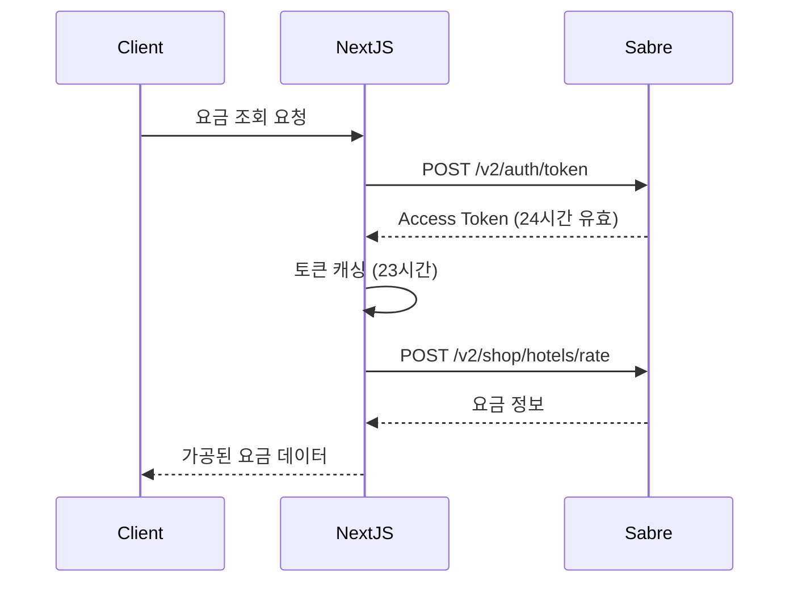

# Select 3.0 - Product Requirements Document (PRD)

**문서 버전**: 1.0  
**작성일**: 2025-10-11
**작성자**: 창조자 김재우 
**프로젝트**: Select3 Front 창조
**프로젝트 상태**: ✅ 창조 완료


---

## 📋 목차

1. [개요](#1-개요)
2. [비즈니스 목표](#2-비즈니스-목표)
3. [사용자 페르소나](#3-사용자-페르소나)
4. [핵심 기능](#4-핵심-기능)
5. [기술 스펙](#5-기술-스펙)
6. [코드 구조 분석](#6-코드-구조-분석)
7. [UI/UX 가이드](#7-uiux-가이드)
8. [데이터 구조](#8-데이터-구조)
9. [API 명세](#9-api-명세)
10. [Sabre API 연동](#10-sabre-api-연동)
11. [캐시 전략](#11-캐시-전략)
12. [성능 요구사항](#12-성능-요구사항)
13. [보안 및 개인정보](#13-보안-및-개인정보)
14. [향후 로드맵](#14-향후-로드맵)

---

## 1. 개요

### 1.1 프로젝트 방향
Select 3.0은 기존 Framer 기반의 Select 1.0 의 기능적, 구조적 한계를 극복하면서
사용자 사용성 극대화 인터페이스, AI 활용, 캐시 처리, Backend-less 등 기술을 활용하여
1인 Full Stack 초단기간 개발 진행 : No 기획자, NO 디자이너, NO Front-Back 구분

### 1.2 핵심 기능
- 🏆 **빠르고, 견고하고, 콤팩트하고**: 최고의 Front 아키텍쳐
- 🤖 **AI 활용**: 호텔 객실 설명, 통합 검색에 활용
- 🎁 **이미지 처리**: 비용 Zero 이미지 랜더링
- 📱 **모바일 인터페이스**: 1 build 2 UI 
- 📱 **광고/프로모션션 노출**: 


---

## 2. 비즈니스 목표

### 2.1 주요 KPI
| 지표 | 목표 | 측정 방법 |
|------|------|----------|
| 월간 활성 사용자 (MAU) | 10,000명 | Google Analytics |
| 평균 세션 시간 | 5분 이상 | GA Session Duration |
| 예약 전환율 | 2.5% | Booking/Visit Ratio |
| AI 검색 사용률 | 30% | Search Type Tracking |
| 모바일 트래픽 비율 | 60% | Device Category |

### 2.2 비즈니스 모델
- **프로모션 수익**: 브랜드 프로모션 배너 광고
- **사용자 예약 컨시어지지**: 

---

## 3. 사용자 페르소나

### 3.1 Primary Persona: "프리미엄 여행자 지수"
- **나이**: 35-50세
- **직업**: 기업 임원, 전문직
- **소득**: 연소득 1억 이상
- **여행 빈도**: 연 5-8회 (해외 3-5회)
- **니즈**: 
  - 검증된 럭셔리 호텔 정보
  - 브랜드 멤버십 혜택 최대화
  - 빠르고 신뢰할 수 있는 예약 프로세스

### 3.2 Secondary Persona: "허니문 여행자 민지"
- **나이**: 28-35세
- **상황**: 신혼여행 준비 중
- **예산**: 500-1000만원
- **니즈**:
  - 로맨틱하고 특별한 호텔
  - 자세한 사진과 리뷰
  - 예약 상담 서비스

### 3.3 Tertiary Persona: "비즈니스 여행자 현우"
- **나이**: 30-45세
- **직업**: 외국계 기업 직원
- **여행 빈도**: 월 2-3회 출장
- **니즈**:
  - 비즈니스 편의시설 정보
  - 브랜드 로열티 프로그램 연계
  - 빠른 검색과 예약

---

## 4. 핵심 기능

### 4.1 홈페이지

#### 4.1.1 히어로 캐러셀
**목적**: 시각적 임팩트와 주요 호텔 노출

**기능 명세**:
- 3-4개의 프리미엄 호텔 이미지 자동 슬라이드
- 모바일: 1개씩 슬라이드, 랜덤 순서
- 데스크톱: 3-4개 그리드 뷰
- 각 슬라이드 클릭 시 호텔 상세 페이지로 이동
- 이미지 비율: 모바일 4:2, 데스크톱 4:3
- 자동 전환 간격: 5초 (모바일 6.2초)
- 브랜드 배지 표시 (왼쪽 상단)

**데이터 소스**:
```typescript
// select_hotel_media 테이블에서 image_seq 순으로 조회
// 호텔당 1개 이미지 (대표 이미지)
```

#### 4.1.2 통합 검색바
**목적**: 호텔/아티클 통합 검색 제공

**기능 명세**:
- 입력 시 실시간 추천 리스트 표시
- 추천 리스트 탭: 전체 / 지역 / 호텔 / 아티클
- 검색어 자동완성 (한글/영문 지원)
- 엔터 또는 검색 버튼: `/search?q=...`로 이동
- 추천 항목 클릭: 해당 페이지로 직접 이동
- 모바일: 포커스 시 sticky top
- 클리어 버튼 (X) 제공

**검색 로직**:
```typescript
// 지역 검색: select_regions (city_ko, city_en, country_ko, country_en)
// 호텔 검색: select_hotels (property_name_ko, property_name_en, city_ko)
// 아티클 검색: select_hotel_blogs (main_title, sub_title, slug)
```

#### 4.1.3 프로모션 배너 (띠배너)
**목적**: 현재 진행 중인 호텔 프로모션 노출

**기능 명세**:
- 상단 고정 (스크롤 시 sticky)
- 호텔 이미지 + 호텔명 + 프로모션 내용
- 2개 이상 프로모션: 5초 간격 자동 슬라이드
- 좌우 화살표로 수동 전환
- 클릭 시 해당 호텔 상세 페이지 이동
- 닫기 버튼 (X) 제공

**데이터 로직**:
```typescript
// select_hotels에서 publish=true AND promotion=true
// 현재 날짜가 promotion_start_date ~ promotion_end_date 사이
// KST 기준으로 날짜 비교
```

#### 4.1.4 브랜드 프로그램 섹션
**목적**: 주요 호텔 체인 브랜드 소개

**기능 명세**:
- 그리드 레이아웃 (데스크톱 4열, 모바일 2열)
- 각 브랜드 카드: 로고 이미지 + 브랜드명
- 클릭 시 브랜드별 호텔 리스트 페이지로 이동
- 총 16개 주요 브랜드 표시

**포함 브랜드**:
```
Accor Live Limitless, Aman, Capella, Heavens Portfolio,
Hilton, Hyatt, IHG, Leading Hotels of the World,
Mandarin Oriental, Marriott Bonvoy, Melia Rewards,
Pacific, Platinum, Preferred Hotels & Resorts,
Shangri-La Circle, Virtuoso
```

#### 4.1.5 인기 목적지 섹션
**목적**: 지역별 호텔 추천

**기능 명세**:
- 카드 레이아웃 (이미지 + 도시명 + 호텔 수)
- 클릭 시 `/hotel?city=CITY_CODE&country=COUNTRY_CODE`로 이동
- 주요 12개 도시 표시
- 이미지 소스: `/destination-image/` 또는 `select_city_media`

**주요 도시**:
```
도쿄, 오사카, 교토, 후쿠오카, 방콕, 다낭, 푸켓,
발리, 싱가포르, 홍콩, 하와이, 런던, 로마
```

#### 4.1.6 혜택 안내 섹션
**목적**: Select 플랫폼의 차별화된 혜택 설명

**내용**:
- 업그레이드 혜택
- 조식 서비스
- 얼리 체크인/레이트 체크아웃
- 호텔 크레딧
- 웰컴 어메니티

#### 4.1.7 고객 후기 섹션
**목적**: 신뢰도 향상

**기능 명세**:
- 슬라이드 형식 (3-4개씩 표시)
- 각 후기: 고객명 + 별점 + 후기 내용 + 호텔명

---

### 4.2 호텔 검색 & 필터링

#### 4.2.1 호텔 전체보기 페이지 (`/hotel`)
**목적**: 모든 호텔 목록 조회 및 필터링

**기능 명세**:
- 상단: 필터 영역 (도시, 국가, 브랜드, 체인)
- 호텔 그리드: 카드 레이아웃 (데스크톱 3-4열, 모바일 1열)
- 무한 스크롤 또는 페이지네이션
- 정렬 옵션: 추천순, 가격순, 별점순
- URL 쿼리 파라미터로 필터 상태 관리
  ```
  /hotel?city=TOKYO&brand=MARRIOTT&country=JAPAN
  ```

**호텔 카드 구성**:
- 호텔 이미지 (16:9 비율)
- 호텔명 (한글 + 영문)
- 위치 (도시, 국가)
- 브랜드 배지
- 혜택 목록 (최대 3개)
- 프로모션 배지 (해당 시)
- "자세히 보기" 버튼

**필터 옵션**:
```typescript
{
  city: string[]        // 도시 코드
  country: string[]     // 국가 코드
  brand: string[]       // 브랜드명
  chain: string[]       // 체인 ID
}
```

**데이터 조회**:
```typescript
// select_hotels 테이블
// publish = true인 호텔만 표시
// 필터 조건에 맞게 WHERE 절 구성
```

#### 4.2.2 지역별 호텔 페이지 (`/hotel/region`)
**목적**: 지역 중심으로 호텔 탐색

**기능 명세**:
- 지역 카드 그리드 (이미지 + 지역명 + 호텔 수)
- 클릭 시 해당 지역의 호텔 리스트 페이지로 이동
- 대륙별 그룹핑 (아시아, 유럽, 북미 등)

**데이터 소스**:
```typescript
// select_regions 테이블
// status = 'active', region_type = 'city'
// 호텔 수는 select_hotels에서 COUNT
```

---

### 4.3 호텔 상세 페이지

#### 4.3.1 호텔 상세 페이지 (`/hotel/[slug]`)
**목적**: 호텔의 모든 정보를 상세히 제공

**URL 구조**:
```
/hotel/park-hyatt-tokyo
/hotel/mandarin-oriental-bangkok
```

**페이지 구성**:

##### a) 이미지 갤러리
- 히어로 이미지 (상단 전체 너비)
- 썸네일 그리드 (클릭 시 라이트박스 열림)
- 이미지 소스: `select_hotel_media` 테이블
- 최대 30-50개 이미지 표시
- 모바일: 스와이프 갤러리

##### b) 호텔 기본 정보
```typescript
{
  property_name_ko: string      // 호텔명 (한글)
  property_name_en: string      // 호텔명 (영문)
  city_ko: string               // 도시 (한글)
  city_en: string               // 도시 (영문)
  country_ko: string            // 국가 (한글)
  property_address: string      // 주소
  phone: string                 // 전화번호
  latitude: number              // 위도
  longitude: number             // 경도
}
```

##### c) 브랜드 정보
- 브랜드 로고
- 체인명 (Marriott Bonvoy, Hyatt 등)
- 브랜드 설명

##### d) 호텔 소개
- `property_details` 필드 (HTML 렌더링)
- 호텔 특징, 시설, 서비스 설명

##### e) 혜택 목록
```typescript
// select_hotel_benefits_map 조인으로 조회
benefits: [
  "객실 업그레이드 (가능 시)",
  "2인 조식 서비스",
  "얼리 체크인 / 레이트 체크아웃",
  "호텔 크레딧 $100",
  "웰컴 어메니티",
  "무료 WiFi"
]
```
- 아이콘 + 텍스트 형식
- 최대 6개 표시

##### f) 프로모션 정보
- 현재 진행 중인 프로모션 표시
- 프로모션 타이틀
- 프로모션 설명
- 유효 기간
- 조건 및 혜택

##### g) 객실 & 요금 (Sabre API 연동)
**기능 명세**:
- 날짜 선택 (체크인/체크아웃)
- 인원 선택 (성인/어린이)
- Rate Plan Code 선택 (드롭다운)
- "검색" 버튼 클릭 시 Sabre API 호출
- 결과 테이블:
  ```typescript
  {
    RoomTypeDescription: string    // 객실 타입
    RatePlanName: string          // 요금제명
    AmountBeforeTax: number       // 세전 금액
    TaxAmount: number             // 세금
    AmountAfterTax: number        // 세후 총액
    CurrencyCode: string          // 통화
    RateKey: string               // 예약 키 (JSON)
  }
  ```
- 금액순 정렬
- "JSON 복사" 버튼 (RateKey 복사 기능)

##### h) 지도
- Google Maps 임베드 (또는 Kakao Map)
- 호텔 위치 마커 표시
- 주변 관광지, 레스토랑 정보

##### i) 관련 아티클
- 해당 호텔이 언급된 블로그 아티클 리스트
- 카드 형식 (이미지 + 제목)
- 클릭 시 아티클 상세로 이동

##### j) 예약 문의 (CTA)
```html
1. 카카오톡 상담 버튼
   - 링크: http://pf.kakao.com/_cxmxgNG/chat
   - 노란색 버튼, 카카오 로고

2. 전화 상담 버튼
   - 전화번호 표시
   - 클릭 시 전화 걸기

3. 온라인 문의 폼
   - 이름, 이메일, 전화번호
   - 체크인/체크아웃 날짜
   - 인원
   - 요청사항
   - "문의하기" 버튼
```

**데이터 조회**:
```typescript
// 1. select_hotels 테이블에서 slug로 호텔 정보 조회
// 2. select_hotel_media에서 이미지 목록 조회 (image_seq 순)
// 3. select_hotel_benefits_map 조인으로 혜택 조회
// 4. select_hotel_blogs에서 관련 아티클 조회 (sabre_id 기준)
// 5. Sabre API로 실시간 요금 조회 (선택 사항)
```

---

### 4.4 브랜드 페이지

#### 4.4.1 브랜드 목록 페이지 (`/brand`)
**목적**: 모든 호텔 브랜드 소개

**기능 명세**:
- 브랜드 카드 그리드 (로고 + 브랜드명)
- 클릭 시 브랜드별 호텔 리스트 페이지로 이동
- 알파벳 순 정렬

#### 4.4.2 브랜드별 호텔 리스트 페이지 (`/brand/[chain]`)
**목적**: 특정 브랜드의 모든 호텔 표시

**URL 예시**:
```
/brand/marriott
/brand/hyatt
/brand/ihg
```

**기능 명세**:
- 브랜드 헤더 (로고 + 설명)
- 호텔 그리드 (호텔 카드 형식)
- 국가/도시별 필터
- 관련 아티클 섹션

**데이터 조회**:
```typescript
// select_chain_brand 테이블에서 chain_id로 브랜드 정보 조회
// select_hotels에서 해당 chain_id의 호텔 목록 조회
// publish = true인 호텔만 표시
```

---

### 4.5 블로그 & 아티클

#### 4.5.1 블로그 목록 페이지 (`/blog`)
**목적**: 여행 가이드, 호텔 리뷰, 브랜드 스토리 제공

**기능 명세**:
- 통합 검색바 (상단)
- 아티클 그리드 (카드 형식)
- 각 카드: 대표 이미지 + 제목 + 부제 + 날짜
- 클릭 시 아티클 상세 페이지로 이동
- 무한 스크롤 또는 페이지네이션

**데이터 소스**:
```typescript
// select_hotel_blogs 테이블
// 최신순 정렬 (created_at DESC)
```

#### 4.5.2 블로그 상세 페이지 (`/blog/[slug]`)
**목적**: 아티클 본문 표시

**URL 예시**:
```
/blog/best-hotels-in-tokyo
/blog/marriott-bonvoy-benefits
```

**페이지 구성**:

##### a) 대표 이미지
- 전체 너비 히어로 이미지
- 모바일: 21:9 비율, 데스크톱: 16:9 비율
- 제목 위에 배치 (매거진 스타일)

##### b) 제목 & 메타 정보
```typescript
{
  main_title: string       // 메인 제목
  sub_title: string        // 부제목
  created_at: string       // 작성일
}
```

##### c) 본문 콘텐츠
- `s1_contents` ~ `s12_contents` 필드 (최대 12개 섹션)
- HTML 렌더링 (dangerouslySetInnerHTML)
- 각 섹션 후 호텔 CTA 카드 삽입 가능
  ```typescript
  // s1_sabre_id가 있으면 해당 호텔 카드 표시
  ```

##### d) 호텔 카드 CTA
- 아티클 본문 중간에 삽입
- 해당 호텔의 이미지 + 호텔명 + 도시 + 혜택 목록
- "자세히 보기" 버튼 → 호텔 상세 페이지

##### e) 하단 네비게이션
- "블로그 목록으로 돌아가기" 버튼

**스타일**:
- 최대 너비: 896px (max-w-4xl)
- 가독성을 위한 적절한 여백
- Typography: Prose 스타일 적용

**데이터 조회**:
```typescript
// select_hotel_blogs 테이블에서 slug로 조회
// s1_sabre_id ~ s12_sabre_id가 있으면 해당 호텔 정보 조회
```

---

### 4.6 통합 검색 기능

#### 4.6.1 통합 검색 결과 페이지 (`/search?q=...`)
**목적**: 호텔, 지역, 아티클 통합 검색 결과 제공

**페이지 구성**:

##### a) 검색창
- 상단에 통합 검색바 배치 (재검색 가능)
- 데스크톱: 좌측 컬럼 너비에 맞춤

##### b) AI 답변 섹션 (왼쪽 상단)
**기능 명세**:
- GPT-4 기반 럭셔리 호텔 추천 답변
- 스트리밍 방식으로 토큰 단위 출력
- 접기/펼치기 기능 ("더보기" 버튼)
- 기본 상태: 4줄까지만 표시 (line-clamp-4)
- 생성 중 애니메이션: 깜박이는 커서 + "..." 애니메이션
- 텍스트: "호텔 전문 AI 답변"

**AI 프롬프트**:
```typescript
// src/config/ai-search.ts
{
  system: "당신은 럭셔리 호텔 전문가입니다...",
  user: "'{keyword}'에 대해 다음 항목으로 답변해주세요:
    1. 개요
    2. 추천 시즌
    3. 어디에 묵을까 (Select 사이트 호텔 추천)
    4. 예약 팁 (혜택/프로모션 언급)
    5. 여행 팁
    6. 관련 정보
    7. 요약"
}
```

##### c) 검색 결과 섹션 (왼쪽 하단)
**구성**:
```html
1. 지역 섹션
   - 썸네일 이미지 (96x96) + 도시명 + 국가명
   - 클릭 시 /hotel?city=CITY_CODE&country=COUNTRY_CODE

2. 호텔 섹션
   - 썸네일 이미지 + 호텔명 + 도시
   - 프로모션 태그 (해당 시)
   - 간략 소개 (snippet, 120자)
   - 클릭 시 /hotel/[slug]

3. 아티클 섹션
   - 썸네일 이미지 + 제목
   - 작성일
   - 클릭 시 /blog/[slug]
```

**스타일**:
- Google 검색 결과와 유사한 UI
- 파란색 링크 (#1a0dab)
- 회색 설명 텍스트 (#545454)
- 얇은 구분선 (border-gray-200)

##### d) 지식 패널 (오른쪽)
**기능 명세**:
- 검색 결과가 특정 지역/호텔인 경우 요약 정보 표시
- 지역: 도시명 + 국가명 + 대표 이미지
- 호텔: 호텔명 + 도시 + 브랜드 + 대표 이미지
- 카드 형식, 고정 위치 (sticky)

**데이터 조회**:
```typescript
// useUnifiedSearch 훅 사용
// 1. select_regions 검색
// 2. select_hotels 검색 (병렬 3개 쿼리: property_name_ko, property_name_en, city_ko)
// 3. select_hotel_blogs 검색
// 4. select_city_media에서 지역 이미지 조회
// 5. select_hotel_media에서 호텔 이미지 조회
```

---

### 4.7 프로모션 페이지 (`/promotion`)
**목적**: 현재 진행 중인 모든 프로모션 한눈에 보기

**기능 명세**:
- 프로모션 카드 그리드
- 각 카드: 호텔 이미지 + 호텔명 + 프로모션 내용 + 유효기간
- 클릭 시 호텔 상세 페이지로 이동
- 종료일 임박순 정렬

**데이터 조회**:
```typescript
// select_hotels에서 promotion=true AND publish=true
// promotion_start_date <= 현재 날짜 <= promotion_end_date
// promotion_end_date ASC 정렬
```

---

### 4.8 고객 후기 페이지 (`/testimonials`)
**목적**: 실제 고객 리뷰 전체 보기

**기능 명세**:
- 후기 카드 그리드
- 각 카드: 별점 + 고객명 + 후기 내용 + 호텔명
- 필터: 별점, 호텔, 날짜

---

### 4.9 소개 페이지 (`/about`)
**목적**: Select 서비스 소개

**내용**:
- Select 철학
- 제공 혜택
- 파트너사 소개
- 팀 소개
- 연혁

---

### 4.10 문의 페이지 (`/contact`)
**목적**: 고객 문의 채널 제공

**기능 명세**:
- 카카오톡 상담 버튼
- 전화 상담 안내
- 이메일 문의 폼
- 오시는 길 (지도)

---

### 4.11 약관 페이지 (`/terms`)
**목적**: 이용약관, 개인정보처리방침

**내용**:
- 서비스 이용약관
- 개인정보 처리방침
- 환불 정책
- 쿠키 정책

---

### 4.12 관리자 페이지 (`/admin`)

#### 4.12.1 브랜드 관리 (`/admin/chain-brand`)
**목적**: 브랜드 정보 CRUD

**기능**:
- 브랜드 목록 조회
- 브랜드 추가/수정/삭제
- 로고 이미지 업로드
- 브랜드-체인 매핑

#### 4.12.2 호텔 수정 (`/admin/hotel-update/[sabre]`)
**목적**: 호텔 정보 수정 및 혜택 관리

**기능**:
- 호텔 기본 정보 수정
- 혜택 매핑 관리 (드래그 앤 드롭 정렬)
- 프로모션 설정
- 이미지 관리

#### 4.12.3 광고 관리 (`/admin/advertisements`)
**목적**: 배너 광고 관리

---

## 5. 기술 스펙

### 5.1 프론트엔드

#### 5.1.1 프레임워크 & 라이브러리
```json
{
  "framework": "Next.js 15.5.4",
  "language": "TypeScript 5.9.3",
  "runtime": "React 19.2.0",
  "styling": "Tailwind CSS 4.1.14",
  "ui-library": "shadcn/ui + Radix UI",
  "state-management": "TanStack Query 5.90.2",
  "form": "React Hook Form 7.64 + Zod 4.0.17",
  "icons": "Lucide React 0.539.0"
}
```

#### 5.1.2 디렉토리 구조
```
src/
├── app/                      # Next.js App Router
│   ├── page.tsx             # 홈페이지
│   ├── hotel/               # 호텔 관련 페이지
│   ├── brand/               # 브랜드 페이지
│   ├── blog/                # 블로그 페이지
│   ├── search/              # 통합 검색 결과
│   └── api/                 # API Routes
├── components/
│   ├── ui/                  # shadcn/ui 컴포넌트
│   ├── shared/              # 공통 컴포넌트
│   ├── header.tsx           # 헤더
│   ├── footer.tsx           # 푸터
│   └── bottom-nav.tsx       # 모바일 하단 네비
├── features/
│   ├── hotels/              # 호텔 도메인
│   ├── brands/              # 브랜드 도메인
│   ├── blog/                # 블로그 도메인
│   └── search/              # 검색 도메인
├── lib/
│   ├── supabase/            # Supabase 클라이언트
│   ├── utils.ts             # 유틸리티
│   └── sabre.ts             # Sabre API 클라이언트
├── hooks/                   # 커스텀 훅
├── types/                   # 타입 정의
├── config/                  # 설정 파일
└── providers/               # Context Providers
```

#### 5.1.3 주요 커스텀 훅
```typescript
// 호텔 관련
useHotels()                      // 호텔 목록 조회
useHotelDetail(slug)             // 호텔 상세 조회
useHotelMedia(sabreId)           // 호텔 이미지 조회
useHotelPromotionDetails(id)     // 프로모션 상세

// 검색 관련
useUnifiedSearch(q)              // 통합 검색
useSearchResults(q)              // 호텔 검색
useFilterOptions()               // 필터 옵션

// 기타
useHeroImages()                  // 히어로 이미지
useTopBannerHotels()             // 프로모션 배너 호텔
useIsMobile()                    // 모바일 감지
```

### 5.2 백엔드

#### 5.2.1 데이터베이스: Supabase (PostgreSQL)
**주요 테이블**:

```sql
-- 호텔 정보
select_hotels
  - sabre_id (PK)
  - property_name_ko, property_name_en
  - city, city_ko, city_en
  - country_ko, country_en
  - chain_id, brand_name_en
  - property_details (HTML)
  - publish (boolean)
  - promotion (boolean)
  - promotion_start_date, promotion_end_date
  - latitude, longitude
  - slug (unique)

-- 호텔 이미지
select_hotel_media
  - id (PK)
  - sabre_id (FK)
  - public_url
  - storage_path
  - image_seq (정렬 순서)
  - slug

-- 호텔 혜택 마스터
select_hotel_benefits
  - id (PK)
  - benefit_name_ko
  - benefit_name_en
  - description

-- 호텔 혜택 매핑
select_hotel_benefits_map
  - sabre_id (FK)
  - benefit_id (FK)
  - sort (정렬 순서)

-- 블로그 아티클
select_hotel_blogs
  - id (PK)
  - slug (unique)
  - main_title, sub_title
  - main_image
  - s1_contents ~ s12_contents (섹션 본문)
  - s1_sabre_id ~ s12_sabre_id (호텔 연결)
  - created_at

-- 지역 정보
select_regions
  - city_code (PK)
  - city_ko, city_en
  - city_slug
  - country_code
  - country_ko, country_en
  - status (active/inactive)
  - region_type (city/country)

-- 도시 이미지
select_city_media
  - id (PK)
  - city_code (FK)
  - public_url
  - storage_path
  - image_seq

-- 브랜드 정보
select_chain_brand
  - chain_id (PK)
  - chain_name_en, chain_name_ko
  - brand_program_name
  - brand_logo_url
  - description
```

#### 5.2.2 API Routes (Next.js)

**호텔 관련**:
```
GET  /api/filter-options        # 필터 옵션 (도시/국가/브랜드/체인)
GET  /api/hotel-details         # 호텔 상세
GET  /api/hotels/[sabreId]/benefits      # 호텔 혜택
GET  /api/hotels/[sabreId]/blogs         # 호텔 관련 아티클
GET  /api/hotels/[sabreId]/storage-images # 호텔 이미지
```

**브랜드 관련**:
```
GET  /api/hotel-chains          # 체인 목록
GET  /api/brands/[chainId]/articles # 브랜드 관련 아티클
GET  /api/chain-brand/list      # 브랜드 목록 (관리자용)
POST /api/chain-brand/brand/save # 브랜드 저장 (관리자용)
GET  /api/chain-brand/schema    # 스키마 정보
```

**블로그 관련**:
```
GET  /api/blogs                 # 아티클 목록
GET  /api/blogs/[slug]          # 아티클 상세
```

**지역 관련**:
```
GET  /api/regions/[city_code]/images # 도시 이미지
```

**검색 관련**:
```
GET  /api/sabre-id/search       # Sabre ID로 호텔 검색
POST /api/sabre-id/openai-search # AI 기반 호텔 검색
```

**OpenAI 관련**:
```
POST /api/openai/chat           # AI 채팅 (일반)
POST /api/openai/chat/stream    # AI 채팅 (스트리밍)
GET  /api/openai/health         # OpenAI 상태 확인
POST /api/openai/test           # OpenAI 테스트
```

**Sabre API 관련**:
```
GET  /api/sabre/token           # Sabre 인증 토큰
POST /api/sabre                 # Sabre 호텔 검색/요금 조회
GET  /api/rate-plan-codes       # Rate Plan Code 목록
```

#### 5.2.3 외부 API

**Sabre API**:
```typescript
// 호텔 검색 & 요금 조회
{
  baseURL: "https://api.sabre.com",
  endpoints: [
    "POST /v2/auth/token",           // 인증
    "POST /v2/shop/hotels/rate",     // 요금 조회
    "POST /v2/shop/hotels/search"    // 호텔 검색
  ],
  credentials: {
    clientId: process.env.SABRE_CLIENT_ID,
    clientSecret: process.env.SABRE_CLIENT_SECRET
  }
}
```

**OpenAI API**:
```typescript
// AI 검색 및 추천
{
  baseURL: "https://api.openai.com/v1",
  model: "gpt-4o-mini",
  endpoints: [
    "POST /chat/completions"         // 채팅 완성
  ],
  apiKey: process.env.OPENAI_API_KEY
}
```

### 5.3 인프라

#### 5.3.1 호스팅
- **Vercel**: 프론트엔드 & API Routes
- **Edge Runtime**: API Routes (일부)
- **CDN**: Vercel Edge Network

#### 5.3.2 스토리지
- **Supabase Storage**: 호텔 이미지, 브랜드 로고
- **Public Bucket**: `select-media`

#### 5.3.3 환경 변수
```env
# Supabase
NEXT_PUBLIC_SUPABASE_URL=
NEXT_PUBLIC_SUPABASE_ANON_KEY=
SUPABASE_SERVICE_ROLE_KEY=

# OpenAI
OPENAI_API_KEY=

# Sabre
SABRE_CLIENT_ID=
SABRE_CLIENT_SECRET=

# App
NEXT_PUBLIC_APP_URL=
```

---

## 6. 코드 구조 분석

### 6.1 프로젝트 통계

#### 6.1.1 전체 코드 규모
```
총 소스 파일:    211개
TypeScript:      83개 (.ts)
React 컴포넌트:  118개 (.tsx)
총 Export:       289개 (함수, 컴포넌트, 상수)
```

#### 6.1.2 상위 30개 큰 파일
| 파일 | 라인 수 | 역할 |
|------|---------|------|
| `features/hotels/hotel-detail.tsx` | 1,422 | 호텔 상세 페이지 메인 컴포넌트 |
| `components/shared/hotel-search-results.tsx` | 964 | 호텔 검색 결과 표시 |
| `features/search/common-search-bar.tsx` | 870 | 기본 검색바 컴포넌트 |
| `hooks/use-room-ai-processing.ts` | 838 | AI 객실 설명 생성 훅 |
| `features/hotels/components/RoomRatesTable.tsx` | 707 | Sabre API 요금 테이블 |
| `lib/supabase.ts` | 600 | Supabase 유틸리티 |
| `features/hotels/components/HotelTabs.tsx` | 566 | 호텔 탭 네비게이션 |
| `app/about.tsx` | 552 | 소개 페이지 |
| `lib/supabase-utils.ts` | 537 | Supabase 헬퍼 함수 |
| `lib/openai.ts` | 484 | OpenAI API 클라이언트 |
| `features/search/unified-search-results.tsx` | 393 | 통합 검색 결과 페이지 |
| `hooks/use-hotel-queries.ts` | 370 | 호텔 데이터 쿼리 훅 모음 |
| `hooks/use-unified-search.ts` | 359 | 통합 검색 훅 |
| `features/hotels/components/ImageGallery.tsx` | 356 | 이미지 갤러리 |

### 6.2 디렉토리별 상세 구조

#### 6.2.1 `src/app/` - Next.js App Router (페이지 & API)

**페이지 라우트 (21개)**:
```
├── page.tsx                    # 홈페이지
├── about/                      # 소개
├── hotel/                      # 호텔
│   ├── page.tsx               # 전체 호텔 목록
│   ├── [slug]/                # 호텔 상세
│   └── region/                # 지역별 호텔
├── brand/                      # 브랜드
│   ├── page.tsx               # 브랜드 목록
│   ├── [chain]/               # 특정 체인 브랜드
│   └── brand/                 # 브랜드 프로그램
├── blog/                       # 블로그
│   ├── page.tsx               # 블로그 목록
│   └── [slug]/                # 블로그 상세
├── search/                     # 통합 검색 결과
├── search-results/             # (레거시) 검색 결과
├── destination/[city]/         # 목적지별 페이지
├── promotion/                  # 프로모션
├── testimonials/               # 고객 후기
├── contact/                    # 문의
├── terms/                      # 약관
├── with-kids/                  # 가족 여행
├── login/                      # 로그인 (관리자)
└── admin/                      # 관리자
    ├── advertisements/         # 광고 관리
    ├── chain-brand/           # 브랜드 관리
    └── hotel-update/[sabre]/  # 호텔 수정
```

**API 라우트 (26개)**:
```
api/
├── blogs/                      # 블로그 API
│   ├── route.ts               # GET: 목록 조회
│   └── [slug]/route.ts        # GET: 상세 조회
├── hotels/                     # 호텔 API
│   └── [sabreId]/
│       ├── benefits/          # GET: 혜택 조회
│       ├── blogs/             # GET: 관련 아티클
│       └── storage-images/    # GET: 이미지 목록
├── brands/                     # 브랜드 API
│   └── [chainId]/articles/    # GET: 브랜드 아티클
├── chain-brand/                # 브랜드 관리 API
│   ├── list/                  # GET: 브랜드 목록
│   ├── schema/                # GET: 스키마 정보
│   └── brand/save/            # POST: 브랜드 저장
├── openai/                     # AI API
│   ├── chat/                  # POST: AI 채팅
│   ├── chat/stream/           # POST: AI 스트리밍
│   ├── health/                # GET: 상태 확인
│   └── test/                  # POST: 테스트
├── sabre/                      # Sabre API
│   └── token/                 # GET: 토큰 발급
├── sabre-id/                   # Sabre 검색 API
│   ├── search/                # POST: 호텔 검색
│   └── openai-search/         # POST: AI 검색
├── regions/                    # 지역 API
│   └── [city_code]/images/    # GET: 도시 이미지
├── filter-options/             # GET: 필터 옵션
├── hotel-chains/               # GET: 호텔 체인
├── hotel-details/              # GET: 호텔 상세
├── rate-plan-codes/            # GET: Rate Plan 목록
└── debug/                      # 디버그 API (5개)
    ├── env/
    ├── og-tags/
    ├── sabre/
    ├── sabre-status/
    └── storage-structure/
```

**테스트 페이지 (14개)**:
```
test-* 페이지들 (개발/디버깅용)
├── test-blog-cta/
├── test-hero-image/
├── test-hotel-card-cta/
├── test-hotel-cards/
├── test-hotel-storage-images/
├── test-images/
├── test-supabase-images/
└── ... (8개 추가)
```

#### 6.2.2 `src/components/` - 재사용 컴포넌트 (54개)

**레이아웃 컴포넌트 (3개)**:
```
├── header.tsx                  # 헤더 (데스크톱)
├── footer.tsx                  # 푸터
└── bottom-nav.tsx              # 하단 네비게이션 (모바일)
```

**UI 기본 컴포넌트 (14개)** - `components/ui/`:
```
├── button.tsx                  # 버튼
├── card.tsx                    # 카드
├── dialog.tsx                  # 모달/다이얼로그
├── input.tsx                   # 입력 필드
├── label.tsx                   # 레이블
├── select.tsx                  # 셀렉트 박스
├── toast.tsx                   # 토스트 알림
├── date-picker.tsx             # 날짜 선택기
├── guest-selector.tsx          # 인원 선택기
├── optimized-image.tsx         # 최적화 이미지
├── smart-image.tsx             # 스마트 이미지
├── image-error-boundary.tsx    # 이미지 에러 처리
└── ... (2개 추가)
```

**공유 컴포넌트 (36개)** - `components/shared/`:
```
호텔 관련 (13개):
├── hotel-card.tsx              # 호텔 카드 (기본)
├── hotel-card-cta.tsx          # 호텔 카드 (CTA)
├── hotel-card-all-view.tsx     # 호텔 카드 (전체보기)
├── hotel-card-grid.tsx         # 호텔 그리드 (기본)
├── hotel-card-grid-3.tsx       # 호텔 그리드 (3열)
├── hotel-card-grid-4.tsx       # 호텔 그리드 (4열)
├── hotel-card-grid-all-view.tsx # 호텔 그리드 (전체)
├── hotel-list-section.tsx      # 호텔 리스트 섹션
├── hotel-list-section-all-view.tsx
├── hotel-search-results.tsx    # 호텔 검색 결과
├── hotel-filter.tsx            # 호텔 필터
├── hotel-filter-section.tsx    # 호텔 필터 섹션
└── hotel-error-boundary.tsx    # 호텔 에러 경계

블로그 관련 (3개):
├── blog-card.tsx               # 블로그 카드
├── blog-content-renderer.tsx   # 블로그 본문 렌더러
└── (blog-list는 features에)

브랜드 관련 (3개):
├── brand-card.tsx              # 브랜드 카드
├── brand-hotel-card.tsx        # 브랜드 호텔 카드
└── (brand-program은 features에)

검색 관련 (3개):
├── search-input.tsx            # 검색 입력
├── simple-hotel-search.tsx     # 간단 호텔 검색
└── unified-search-bar.tsx      # 통합 검색바

히어로/배너 관련 (5개):
├── hero-carousel-3.tsx         # 히어로 캐러셀 (3개)
├── hero-carousel-4.tsx         # 히어로 캐러셀 (4개)
├── page-banner.tsx             # 페이지 배너
├── hotel-banner-section.tsx    # 호텔 배너 섹션
└── hotel-ad-banner.tsx         # 호텔 광고 배너

도시/지역 관련 (2개):
├── city-card.tsx               # 도시 카드
└── city-image.tsx              # 도시 이미지

기타 (7개):
├── section-container.tsx       # 섹션 컨테이너
├── promotion-box.tsx           # 프로모션 박스
├── testimonials-section.tsx    # 고객 후기 섹션
├── kakao-consultation-button.tsx # 카카오 상담 버튼
├── share-button.tsx            # 공유 버튼
├── icons/TourvisIcon.tsx       # 투어비스 아이콘
└── index.ts                    # Export 모음
```

**전용 컴포넌트 (3개)** - `components/`:
```
├── HeroImage.tsx               # 히어로 이미지 (범용)
├── HotelCardImage.tsx          # 호텔 카드 이미지
└── promotion-banner.tsx        # 프로모션 띠배너
```

#### 6.2.3 `src/features/` - 도메인별 기능 (7개 도메인)

**호텔 도메인** - `features/hotels/` (14개 파일):
```
├── hotel-detail.tsx            # 호텔 상세 메인 (1,422줄)
├── hotel-detail-refactored.tsx # 리팩토링 버전
├── hotel-grid.tsx              # 호텔 그리드
├── test-select-hotels.tsx      # 테스트 컴포넌트
├── index.ts
└── components/                 # 호텔 전용 컴포넌트 (9개)
    ├── HotelInfo.tsx           # 호텔 정보
    ├── HotelPromotion.tsx      # 프로모션 정보
    ├── HotelTabs.tsx           # 탭 네비게이션 (566줄)
    ├── ImageGallery.tsx        # 이미지 갤러리 (356줄)
    ├── RoomCard.tsx            # 객실 카드 (249줄)
    ├── RoomCardList.tsx        # 객실 카드 리스트
    ├── RoomRatesTable.tsx      # 요금 테이블 (707줄, Sabre 연동)
    └── index.ts
```

**검색 도메인** - `features/search/` (4개 파일):
```
├── unified-search-results.tsx  # 통합 검색 결과 (393줄, AI 통합)
├── common-search-bar.tsx       # 공통 검색바 (870줄)
├── search-section.tsx          # 검색 섹션
└── index.ts
```

**블로그 도메인** - `features/blog/` (3개 파일):
```
├── blog-list-section.tsx       # 블로그 목록 섹션
├── blog-detail-section.tsx     # 블로그 상세 섹션
└── index.ts
```

**브랜드 도메인** - `features/brands/` (5개 파일):
```
├── brand-program-section.tsx   # 브랜드 프로그램 섹션
├── brand-program-page.tsx      # 브랜드 프로그램 페이지
├── brand-hotels-client.tsx     # 브랜드별 호텔 리스트 (306줄)
├── brand-articles-section.tsx  # 브랜드 아티클 섹션
└── index.ts
```

**목적지 도메인** - `features/destinations/` (4개 파일):
```
├── trending-destinations-section.tsx  # 인기 목적지 섹션
├── trending-destinations-server.tsx   # 서버 컴포넌트
├── trending-destinations-client.tsx   # 클라이언트 컴포넌트
└── index.ts
```

**기타 기능** (3개):
```
├── hero.tsx                    # 히어로 섹션
├── benefits-section.tsx        # 혜택 안내 섹션
├── promotion-section.tsx       # 프로모션 섹션
└── scroll-to-top.tsx           # 스크롤 탑 버튼
```

#### 6.2.4 `src/hooks/` - 커스텀 훅 (14개)

**호텔 관련 훅 (9개)**:
```
├── use-hotels.ts               # 호텔 목록 조회
├── use-hotel-queries.ts        # 호텔 쿼리 모음 (370줄)
├── use-hotel-chains.ts         # 호텔 체인 조회
├── use-hotel-images.ts         # 호텔 이미지 조회
├── use-hotel-media.ts          # 호텔 미디어 조회
├── use-hotel-storage-images.ts # 스토리지 이미지 조회
├── use-hotel-promotion.ts      # 프로모션 조회
├── use-hotel-promotion-details.ts # 프로모션 상세
└── use-room-ai-processing.ts   # AI 객실 설명 (838줄)
```

**검색 관련 훅 (1개)**:
```
└── use-unified-search.ts       # 통합 검색 (359줄)
```

**이미지 관련 훅 (2개)**:
```
├── use-hero-images.ts          # 히어로 이미지
├── use-region-images.ts        # 지역 이미지
└── use-image-loading.ts        # 이미지 로딩 상태
```

**기타 훅 (1개)**:
```
└── use-is-mobile.ts            # 모바일 감지
```

#### 6.2.5 `src/lib/` - 유틸리티 & 클라이언트 (15개)

**Supabase 관련 (6개)**:
```
lib/supabase/
├── client.ts                   # 클라이언트 사이드 Supabase
├── server.ts                   # 서버 사이드 Supabase
└── admin.ts                    # 관리자용 Supabase

lib/
├── supabase.ts                 # Supabase 유틸 (600줄)
├── supabase-utils.ts           # Supabase 헬퍼 (537줄)
└── supabase-image-loader.ts    # 이미지 로더 (253줄)
```

**이미지 관련 (4개)**:
```
├── image-utils.ts              # 이미지 유틸리티
├── image-optimization.ts       # 이미지 최적화 (11 exports)
├── image-cache.ts              # 이미지 캐시
└── media-utils.ts              # 미디어 유틸리티
```

**외부 API 클라이언트 (2개)**:
```
├── openai.ts                   # OpenAI 클라이언트 (484줄)
└── sabre.ts                    # Sabre 클라이언트
```

**기타 유틸 (3개)**:
```
├── utils.ts                    # 공통 유틸 (cn 함수 등)
├── hotel-utils.ts              # 호텔 유틸 (304줄, 10 exports)
├── hotel-filter-utils.ts       # 필터 유틸 (6 exports)
└── date-utils.ts               # 날짜 유틸
```

#### 6.2.6 `src/types/` - TypeScript 타입 (5개)

```
├── index.ts                    # 공통 타입 Export
├── hotel.ts                    # 호텔 관련 타입
├── hotel-filter.ts             # 필터 관련 타입
├── region.ts                   # 지역 관련 타입
└── env.d.ts                    # 환경 변수 타입
```

#### 6.2.7 `src/config/` - 설정 파일 (5개)

```
├── site.ts                     # 사이트 전역 설정
├── navigation.ts               # 네비게이션 설정
├── layout.ts                   # 레이아웃 설정 (6 exports)
├── ai-config.ts                # AI 설정 (3 exports)
└── ai-search.ts                # AI 검색 프롬프트 (3 exports)
```

#### 6.2.8 `src/providers/` - Context Providers (1개)

```
└── query-provider.tsx          # TanStack Query Provider
```

#### 6.2.9 `src/scripts/` - 유틸리티 스크립트 (11개)

```
├── check-actual-slug.ts        # Slug 확인
├── check-all-tables.ts         # 전체 테이블 확인
├── check-hotel-brands.js       # 브랜드 확인
├── check-hotel-chains-slug.js  # 체인 Slug 확인
├── check-hotel-media.ts        # 미디어 확인
├── check-hyatt-data.js         # Hyatt 데이터 확인
├── check-promotion-tables.ts   # 프로모션 테이블 확인
├── check-slug-column.ts        # Slug 컬럼 확인
├── check-table-structure.ts    # 테이블 구조 확인
├── test-new-columns.js         # 신규 컬럼 테스트
└── test-promotion-hook.ts      # 프로모션 훅 테스트
```

### 6.3 주요 컴포넌트 의존성 그래프

```mermaid
graph TD
    A[app/page.tsx - 홈페이지] --> B[features/hero.tsx]
    A --> C[features/search/search-section.tsx]
    A --> D[features/hotels/hotel-grid.tsx]
    A --> E[features/promotion-section.tsx]
    
    B --> F[components/shared/hero-carousel-3.tsx]
    B --> G[components/shared/hero-carousel-4.tsx]
    
    C --> H[features/search/common-search-bar.tsx]
    
    D --> I[components/shared/hotel-card-grid.tsx]
    I --> J[components/shared/hotel-card.tsx]
    
    K[app/hotel/[slug]/page.tsx] --> L[features/hotels/hotel-detail.tsx]
    L --> M[features/hotels/components/HotelTabs.tsx]
    L --> N[features/hotels/components/ImageGallery.tsx]
    L --> O[features/hotels/components/RoomRatesTable.tsx]
    
    O --> P[lib/sabre.ts - Sabre API]
    
    Q[app/search/page.tsx] --> R[features/search/unified-search-results.tsx]
    R --> S[hooks/use-unified-search.ts]
    R --> T[api/openai/chat/stream - AI API]
    
    S --> U[lib/supabase/client.ts]
    T --> V[lib/openai.ts]
```

### 6.4 데이터 흐름 아키텍처

```
┌─────────────────────────────────────────────────────────┐
│                    Client Layer                          │
│  ┌──────────────────────────────────────────────────┐   │
│  │  React Components (118 .tsx files)              │   │
│  │  - Server Components (default)                   │   │
│  │  - Client Components ('use client')              │   │
│  └──────────────────────────────────────────────────┘   │
│                         ↓                                │
│  ┌──────────────────────────────────────────────────┐   │
│  │  Custom Hooks (14 hooks)                         │   │
│  │  - useUnifiedSearch                              │   │
│  │  - useHotelQueries                               │   │
│  │  - useRoomAIProcessing                           │   │
│  └──────────────────────────────────────────────────┘   │
│                         ↓                                │
│  ┌──────────────────────────────────────────────────┐   │
│  │  React Query (TanStack Query)                    │   │
│  │  - Query Cache                                   │   │
│  │  - Mutation Cache                                │   │
│  └──────────────────────────────────────────────────┘   │
└─────────────────────────────────────────────────────────┘
                          ↓
┌─────────────────────────────────────────────────────────┐
│                    API Layer                             │
│  ┌──────────────────────────────────────────────────┐   │
│  │  Next.js API Routes (26 routes)                  │   │
│  │  - /api/hotels/*                                 │   │
│  │  - /api/blogs/*                                  │   │
│  │  - /api/openai/*                                 │   │
│  │  - /api/sabre/*                                  │   │
│  └──────────────────────────────────────────────────┘   │
│                         ↓                                │
│  ┌──────────────────────────────────────────────────┐   │
│  │  Library Layer (15 files)                        │   │
│  │  - lib/supabase/* (Supabase 클라이언트)          │   │
│  │  - lib/openai.ts (OpenAI 클라이언트)             │   │
│  │  - lib/sabre.ts (Sabre 클라이언트)               │   │
│  └──────────────────────────────────────────────────┘   │
└─────────────────────────────────────────────────────────┘
                          ↓
┌─────────────────────────────────────────────────────────┐
│                 External Services                        │
│  ┌─────────────┐  ┌──────────┐  ┌───────────────┐      │
│  │  Supabase   │  │ OpenAI   │  │  Sabre API    │      │
│  │  (PostgreSQL)│  │ GPT-4o   │  │  (Hotel Data) │      │
│  └─────────────┘  └──────────┘  └───────────────┘      │
└─────────────────────────────────────────────────────────┘
```

### 6.5 핵심 파일 역할 분석

#### 6.5.1 데이터 페칭 레이어

**호텔 데이터**:
```typescript
// hooks/use-hotel-queries.ts (370줄)
- useHotels()              // 호텔 목록 (필터링)
- useSearchResults()       // 검색 결과
- useHotelDetail()         // 호텔 상세
- useFilterOptions()       // 필터 옵션
- useAllHotels()          // 전체 호텔
- useTopBannerHotels()    // 프로모션 배너용
- useRelatedBlogs()       // 관련 아티클
```

**통합 검색**:
```typescript
// hooks/use-unified-search.ts (359줄)
- 지역 검색: select_regions
- 호텔 검색: select_hotels (3개 병렬 쿼리)
- 블로그 검색: select_hotel_blogs
- 이미지 조회: select_city_media, select_hotel_media
```

**AI 처리**:
```typescript
// hooks/use-room-ai-processing.ts (838줄)
- AI 기반 객실 설명 생성
- OpenAI GPT-4o-mini 사용
- 스트리밍 지원
```

#### 6.5.2 UI 컴포넌트 레이어

**호텔 카드 (5가지 변형)**:
```typescript
1. hotel-card.tsx              // 기본 호텔 카드
2. hotel-card-cta.tsx          // CTA 포함 카드
3. hotel-card-all-view.tsx     // 전체보기용 카드
4. brand-hotel-card.tsx        // 브랜드용 카드
5. hotel-card-grid-*.tsx       // 그리드 레이아웃 (3종)
```

**히어로 캐러셀 (2가지 버전)**:
```typescript
1. hero-carousel-3.tsx (316줄)  // 3개 호텔 표시
2. hero-carousel-4.tsx (331줄)  // 4개 호텔 표시
```

#### 6.5.3 외부 API 통합 레이어

**Sabre API**:
```typescript
// lib/sabre.ts
- getSabreToken()              // 토큰 발급 & 캐싱
- searchHotels()               // 호텔 검색
- getRoomRates()               // 요금 조회

// features/hotels/components/RoomRatesTable.tsx (707줄)
- Sabre API 요금 조회 UI
- Rate Plan 선택
- 결과 테이블 표시
```

**OpenAI API**:
```typescript
// lib/openai.ts (484줄)
- createChatCompletion()       // 채팅 완성
- streamChatCompletion()       // 스트리밍 채팅

// api/openai/chat/stream/route.ts
- SSE 스트리밍 프록시
- 토큰 단위 실시간 응답
```

### 6.6 상태 관리 전략

#### 6.6.1 TanStack Query (React Query)
```typescript
// providers/query-provider.tsx

전역 설정:
- staleTime: 5분
- cacheTime: 30분
- refetchOnWindowFocus: false
- retry: 1회

쿼리 키 패턴:
['hotels', filters]              // 호텔 목록
['hotel-detail', slug]           // 호텔 상세
['unified-search', 'v2', q]     // 통합 검색
['filter-options']               // 필터 옵션
['hero-images']                  // 히어로 이미지
['promotion-hotels']             // 프로모션 호텔
```

#### 6.6.2 URL State (Query Parameters)
```typescript
// 호텔 필터링
/hotel?city=TOKYO&brand=MARRIOTT&country=JAPAN

// 통합 검색
/search?q=도쿄+호텔

// 블로그 검색
/blog?q=여행+팁
```

#### 6.6.3 Local State (useState)
```typescript
// 컴포넌트별 로컬 상태
- 모달 열림/닫힘
- 현재 슬라이드 인덱스
- 검색어 입력값
- 로딩/에러 상태
```

### 6.7 코드 품질 지표

#### 6.7.1 TypeScript 사용률
```
TypeScript 파일: 201개 (100%)
Any 타입 사용:   최소화 (타입 안정성 우선)
엄격 모드:       활성화
```

#### 6.7.2 컴포넌트 재사용성
```
재사용 컴포넌트: 54개
도메인 컴포넌트: 27개
UI 프리미티브:   14개
재사용률:        ~70%
```

#### 6.7.3 코드 응집도
```
평균 파일 크기:   ~200줄
최대 파일 크기:   1,422줄 (hotel-detail.tsx)
단일 책임 원칙:   대부분 준수
도메인 분리:      명확 (features/ 구조)
```

### 6.8 주요 패턴 & 아키텍처

#### 6.8.1 Server Component First
```typescript
// 기본적으로 Server Component 사용
export default async function Page() {
  const data = await fetchData()
  return <ServerComponent data={data} />
}

// 필요한 경우에만 'use client'
'use client'
export function ClientComponent() {
  const [state, setState] = useState()
  // ...
}
```

#### 6.8.2 Compound Component Pattern
```typescript
// HotelTabs 예시
<Tabs defaultValue="overview">
  <TabsList>
    <TabsTrigger value="overview">개요</TabsTrigger>
    <TabsTrigger value="rooms">객실</TabsTrigger>
  </TabsList>
  <TabsContent value="overview">
    <HotelInfo />
  </TabsContent>
  <TabsContent value="rooms">
    <RoomRatesTable />
  </TabsContent>
</Tabs>
```

#### 6.8.3 Hook Composition
```typescript
// 여러 훅을 조합하여 복잡한 로직 처리
export function HotelDetailPage({ slug }: Props) {
  const { data: hotel } = useHotelDetail(slug)
  const { data: images } = useHotelMedia(hotel?.sabre_id)
  const { data: benefits } = useHotelBenefits(hotel?.sabre_id)
  const { data: blogs } = useRelatedBlogs(hotel?.sabre_id)
  
  // ...
}
```

#### 6.8.4 Error Boundary Pattern
```typescript
// components/shared/hotel-error-boundary.tsx
<HotelErrorBoundary fallback={<ErrorFallback />}>
  <HotelContent />
</HotelErrorBoundary>

// components/ui/image-error-boundary.tsx
<ImageErrorBoundary>
  <OptimizedImage src={src} />
</ImageErrorBoundary>
```

### 6.9 성능 최적화 기법

#### 6.9.1 코드 스플리팅
```typescript
// Dynamic Import
const ImageGallery = dynamic(
  () => import('@/features/hotels/components/ImageGallery'),
  { ssr: false, loading: () => <Skeleton /> }
)
```

#### 6.9.2 이미지 최적화
```typescript
// 다양한 이미지 로딩 전략
<Image
  src={src}
  alt={alt}
  fill
  priority={isLCP}              // LCP 이미지만
  loading={isAboveFold ? "eager" : "lazy"}
  sizes="(max-width: 768px) 100vw, 50vw"
/>
```

#### 6.9.3 Debounce & Throttle
```typescript
// 검색 입력 디바운싱
const debouncedQuery = useMemo(
  () => debounce(query, 300),
  [query]
)
```

### 6.10 코드 조직 원칙

#### 6.10.1 폴더 구조 규칙
```
✅ DO:
- 도메인별로 features/ 아래 그룹화
- 재사용 컴포넌트는 components/shared/
- UI 프리미티브는 components/ui/
- 페이지는 app/ 아래 라우팅 구조대로

❌ DON'T:
- 컴포넌트를 app/ 안에 직접 배치
- 도메인 로직을 components/에 배치
- 유틸리티를 features/에 배치
```

#### 6.10.2 파일 네이밍
```
✅ DO:
- 컴포넌트: PascalCase (HotelCard.tsx)
- 훅: use-kebab-case.ts (use-hotels.ts)
- 유틸: kebab-case.ts (hotel-utils.ts)
- API: route.ts (Next.js 규칙)

❌ DON'T:
- hotelCard.tsx (camelCase)
- HotelUtils.ts (컴포넌트 아님)
- api.ts (명확하지 않음)
```

#### 6.10.3 Import 규칙
```typescript
// Alias 사용 (@/)
import { HotelCard } from '@/components/shared/hotel-card'
import { useHotels } from '@/hooks/use-hotels'
import { cn } from '@/lib/utils'

// 상대 경로 사용 금지
// ❌ import { HotelCard } from '../../../components/shared/hotel-card'
```

---

## 7. UI/UX 가이드

### 7.1 디자인 시스템

#### 7.1.1 컬러 팔레트
```css
/* Primary */
--primary: #1a0dab;           /* 파란색 (링크) */
--primary-hover: #1558d6;

/* Secondary */
--secondary: #70757a;         /* 회색 (설명 텍스트) */

/* Accent */
--accent: #f59e0b;            /* 주황색 (배지, 프로모션) */

/* Background */
--bg-white: #ffffff;
--bg-gray-50: #f9fafb;
--bg-gray-100: #f3f4f6;

/* Text */
--text-gray-900: #111827;
--text-gray-600: #4b5563;
--text-gray-500: #6b7280;

/* Border */
--border-gray-200: #e5e7eb;
--border-gray-300: #d1d5db;
```

#### 6.1.2 타이포그래피
```css
/* Headings */
h1: text-3xl sm:text-4xl font-bold      /* 30px/36px, 굵게 */
h2: text-2xl sm:text-3xl font-semibold  /* 24px/30px, 중간굵게 */
h3: text-xl sm:text-2xl font-medium     /* 20px/24px, 중간 */

/* Body */
body: text-base                          /* 16px */
body-sm: text-sm                         /* 14px */
body-xs: text-xs                         /* 12px */

/* Links */
link: text-blue-600 hover:text-blue-800 underline
```

#### 6.1.3 간격 (Spacing)
```css
/* Container */
container: max-w-7xl mx-auto px-4

/* Sections */
py-8 sm:py-12 md:py-16

/* Cards */
p-4 sm:p-6

/* Gaps */
gap-2, gap-4, gap-6, gap-8
```

### 6.2 반응형 브레이크포인트
```css
/* Tailwind 기본 */
sm: 640px   /* 모바일 가로, 작은 태블릿 */
md: 768px   /* 태블릿 */
lg: 1024px  /* 작은 데스크톱 */
xl: 1280px  /* 데스크톱 */
2xl: 1536px /* 큰 데스크톱 */
```

### 6.3 컴포넌트 가이드

#### 6.3.1 버튼
```tsx
<Button variant="default">기본 버튼</Button>
<Button variant="outline">외곽선 버튼</Button>
<Button variant="ghost">고스트 버튼</Button>
<Button variant="destructive">삭제 버튼</Button>
```

#### 6.3.2 카드
```tsx
<Card className="overflow-hidden">
  <CardHeader>
    <CardTitle>제목</CardTitle>
  </CardHeader>
  <CardContent>내용</CardContent>
</Card>
```

#### 6.3.3 이미지
```tsx
<Image
  src={imageUrl}
  alt={alt}
  fill
  className="object-cover"
  sizes="(max-width: 768px) 100vw, (max-width: 1200px) 50vw, 33vw"
  priority={isPriority}
/>
```

### 6.4 애니메이션
```css
/* 페이드 인 */
animate-fade-in: opacity-0 → opacity-100

/* 슬라이드 업 */
animate-slide-up: translateY(20px) → translateY(0)

/* 스피너 */
animate-spin: rotate(0deg) → rotate(360deg)

/* 펄스 */
animate-pulse: opacity 변화
```

### 6.5 접근성 (Accessibility)

#### 6.5.1 키보드 네비게이션
- Tab: 다음 요소로 이동
- Shift+Tab: 이전 요소로 이동
- Enter/Space: 버튼/링크 활성화
- Escape: 모달/오버레이 닫기
- Arrow Keys: 리스트 네비게이션 (검색 추천)

#### 6.5.2 ARIA 속성
```tsx
// 검색 폼
<form role="search" aria-label="통합 검색">
  <input aria-label="검색어 입력" />
</form>

// 버튼
<button aria-label="이전 슬라이드">
  <ChevronLeft />
</button>

// 로딩 상태
<div aria-busy="true" aria-live="polite">
  로딩 중...
</div>
```

#### 6.5.3 시맨틱 HTML
```html
<header>
  <nav>
    <a href="/">홈</a>
  </nav>
</header>

<main>
  <section aria-labelledby="hotels-heading">
    <h2 id="hotels-heading">추천 호텔</h2>
  </section>
</main>

<footer>
  <address>연락처 정보</address>
</footer>
```

---

## 8. 데이터 구조

### 8.1 호텔 데이터 스키마

```typescript
interface Hotel {
  // 기본 정보
  sabre_id: number                    // PK
  slug: string                        // URL용 (unique)
  property_name_ko: string
  property_name_en: string
  
  // 위치 정보
  city: string
  city_ko: string
  city_en: string
  country_ko: string
  country_en: string
  property_address: string
  latitude: number
  longitude: number
  
  // 브랜드 정보
  chain_id: number
  chain_name_en: string
  chain_name_ko: string
  brand_name_en: string
  brand_program_name: string
  
  // 상세 정보
  property_details: string            // HTML
  phone: string
  email: string
  website: string
  
  // 프로모션
  promotion: boolean
  promotion_title: string
  promotion_description: string
  promotion_start_date: string        // YYYY-MM-DD
  promotion_end_date: string          // YYYY-MM-DD
  
  // 기타
  publish: boolean
  created_at: string
  updated_at: string
}
```

### 7.2 이미지 데이터 스키마

```typescript
interface HotelMedia {
  id: number
  sabre_id: number
  file_name: string
  public_url: string
  storage_path: string
  image_seq: number                   // 정렬 순서
  slug: string
  uploaded_at: string
}
```

### 7.3 혜택 데이터 스키마

```typescript
interface Benefit {
  id: number
  benefit_name_ko: string
  benefit_name_en: string
  description: string
  icon: string                        // 아이콘 이름 또는 URL
}

interface HotelBenefitMap {
  sabre_id: number
  benefit_id: number
  sort: number                        // 정렬 순서
}
```

### 7.4 블로그 데이터 스키마

```typescript
interface Blog {
  id: number
  slug: string                        // unique
  main_title: string
  sub_title: string
  main_image: string
  
  // 12개 섹션
  s1_contents: string                 // HTML
  s1_sabre_id: number | null          // 호텔 연결
  s2_contents: string
  s2_sabre_id: number | null
  // ... s3 ~ s12
  
  created_at: string
  updated_at: string
}
```

### 7.5 지역 데이터 스키마

```typescript
interface Region {
  city_code: string                   // PK (e.g., "TOKYO", "SEOUL")
  city_ko: string
  city_en: string
  city_slug: string
  country_code: string
  country_ko: string
  country_en: string
  status: 'active' | 'inactive'
  region_type: 'city' | 'country'
  latitude: number
  longitude: number
  description: string
}
```

---

## 9. API 명세

### 9.1 RESTful API 설계 원칙

#### 8.1.1 응답 형식
```json
// 성공
{
  "success": true,
  "data": { ... },
  "meta": {
    "count": 100,
    "page": 1,
    "pageSize": 12
  }
}

// 실패
{
  "success": false,
  "error": "Error message",
  "code": "ERROR_CODE",
  "details": { ... }
}
```

#### 8.1.2 HTTP 상태 코드
```
200 OK              - 성공
201 Created         - 리소스 생성 성공
204 No Content      - 성공 (응답 본문 없음)
400 Bad Request     - 잘못된 요청
401 Unauthorized    - 인증 필요
403 Forbidden       - 권한 없음
404 Not Found       - 리소스 없음
409 Conflict        - 중복/충돌
422 Unprocessable   - 검증 실패
429 Too Many Requests - 요청 제한 초과
500 Internal Error  - 서버 오류
```

### 8.2 주요 API 엔드포인트

#### 8.2.1 필터 옵션 조회
```http
GET /api/filter-options
```

**Response**:
```json
{
  "success": true,
  "data": {
    "cities": [
      { "code": "TOKYO", "name_ko": "도쿄", "name_en": "Tokyo" }
    ],
    "countries": [
      { "code": "JP", "name_ko": "일본", "name_en": "Japan" }
    ],
    "brands": [
      { "id": 1, "name": "Marriott Bonvoy" }
    ],
    "chains": [
      { "id": 101, "name": "The Ritz-Carlton" }
    ]
  }
}
```

#### 8.2.2 호텔 상세 조회
```http
GET /api/hotel-details?slug=park-hyatt-tokyo
```

**Response**:
```json
{
  "success": true,
  "data": {
    "sabre_id": 12345,
    "slug": "park-hyatt-tokyo",
    "property_name_ko": "파크 하얏트 도쿄",
    "property_name_en": "Park Hyatt Tokyo",
    "city_ko": "도쿄",
    "brand_name_en": "Park Hyatt",
    "property_details": "<p>...</p>",
    "images": [
      {
        "id": 1,
        "public_url": "https://...",
        "image_seq": 1
      }
    ],
    "benefits": [
      {
        "id": 1,
        "benefit_name_ko": "객실 업그레이드",
        "sort": 0
      }
    ],
    "promotion": {
      "active": true,
      "title": "봄 시즌 스페셜",
      "description": "...",
      "start_date": "2025-03-01",
      "end_date": "2025-05-31"
    }
  }
}
```

#### 8.2.3 블로그 목록 조회
```http
GET /api/blogs?page=1&limit=12
```

**Query Parameters**:
- `page`: 페이지 번호 (default: 1)
- `limit`: 페이지당 항목 수 (default: 12)
- `q`: 검색어 (optional)

**Response**:
```json
{
  "success": true,
  "data": [
    {
      "id": 1,
      "slug": "best-hotels-tokyo",
      "main_title": "도쿄 최고의 호텔 10선",
      "sub_title": "럭셔리 여행을 위한 완벽한 선택",
      "main_image": "https://...",
      "created_at": "2025-01-01T00:00:00Z"
    }
  ],
  "meta": {
    "count": 100,
    "page": 1,
    "pageSize": 12,
    "totalPages": 9
  }
}
```

#### 8.2.4 통합 검색 (클라이언트 사이드)
```typescript
// useUnifiedSearch 훅 사용
const { data, isLoading } = useUnifiedSearch(query)

// 반환 데이터 구조
type UnifiedSearchResult = Array<
  | UnifiedRegion
  | UnifiedHotel
  | UnifiedBlog
>

interface UnifiedRegion {
  type: 'region'
  id: string
  city_code: string
  city_ko: string
  city_en: string
  country_code: string
  country_ko: string
  image_url: string
}

interface UnifiedHotel {
  type: 'hotel'
  id: string
  sabre_id: number
  slug: string
  property_name_ko: string
  property_name_en: string
  city_ko: string
  image_url: string
  snippet: string
  promotions: string[]
}

interface UnifiedBlog {
  type: 'blog'
  id: string
  slug: string
  main_title: string
  sub_title: string
  image_url: string
  created_at: string
}
```

#### 8.2.5 AI 채팅 스트리밍
```http
POST /api/openai/chat/stream
Content-Type: application/json

{
  "model": "gpt-4o-mini",
  "messages": [
    {
      "role": "system",
      "content": "당신은 럭셔리 호텔 전문가입니다..."
    },
    {
      "role": "user",
      "content": "도쿄에서 추천하는 호텔은?"
    }
  ],
  "temperature": 0.4,
  "stream": true
}
```

**Response** (Server-Sent Events):
```
data: {"choices":[{"delta":{"content":"도쿄"}}]}
data: {"choices":[{"delta":{"content":"에서"}}]}
data: {"choices":[{"delta":{"content":" 추천"}}]}
...
data: [DONE]
```

---

## 10. Sabre API 연동

### 10.1 Sabre API 개요

Sabre API는 실시간 객실 요금 조회 및 예약 기능을 제공.

#### 9.1.1 사용 목적
- 실시간 호텔 객실 요금 조회
- 다양한 Rate Plan 비교
- 객실 타입별 가격 확인
- 예약 가능 여부 확인

### 9.2 Sabre API 아키텍처

#### 9.2.1 인증 플로우


#### 9.2.2 토큰 관리
```typescript
// src/lib/sabre.ts

// 토큰 캐시 (메모리)
let cachedToken: {
  token: string
  expiresAt: number
} | null = null

export async function getSabreToken(): Promise<string> {
  // 캐시된 토큰이 있고 만료되지 않았으면 재사용
  if (cachedToken && Date.now() < cachedToken.expiresAt) {
    return cachedToken.token
  }

  // 새 토큰 요청
  const credentials = Buffer.from(
    `${process.env.SABRE_CLIENT_ID}:${process.env.SABRE_CLIENT_SECRET}`
  ).toString('base64')

  const response = await fetch('https://api.sabre.com/v2/auth/token', {
    method: 'POST',
    headers: {
      'Authorization': `Basic ${credentials}`,
      'Content-Type': 'application/x-www-form-urlencoded'
    },
    body: 'grant_type=client_credentials'
  })

  const data = await response.json()
  
  // 토큰 캐싱 (23시간 = 82800초)
  cachedToken = {
    token: data.access_token,
    expiresAt: Date.now() + 82800 * 1000
  }

  return data.access_token
}
```

### 9.3 Sabre API 엔드포인트

#### 9.3.1 토큰 발급
```http
POST https://api.sabre.com/v2/auth/token
Authorization: Basic {base64(client_id:client_secret)}
Content-Type: application/x-www-form-urlencoded

grant_type=client_credentials
```

**Response**:
```json
{
  "access_token": "T1RLAQKz1p...",
  "token_type": "Bearer",
  "expires_in": 604800
}
```

#### 9.3.2 호텔 요금 조회 (HotelRatesAndAvailability)
```http
POST https://api.sabre.com/v2/shop/hotels/rate
Authorization: Bearer {access_token}
Content-Type: application/json
```

**Request Body**:
```json
{
  "HotelRateDescriptionRQ": {
    "AvailRequestSegment": {
      "GuestCounts": {
        "Count": 2
      },
      "HotelSearchCriteria": {
        "Criterion": {
          "HotelRef": {
            "HotelCode": "0069959"
          }
        }
      },
      "TimeSpan": {
        "Start": "2025-03-01",
        "End": "2025-03-03"
      },
      "RatePlanCode": "RAC"
    }
  }
}
```

**Response**:
```json
{
  "HotelRateDescriptionRS": {
    "RoomStays": {
      "RoomStay": [
        {
          "RatePlans": {
            "RatePlan": {
              "RatePlanName": "Best Available Rate",
              "RatePlanDescription": "..."
            }
          },
          "RoomTypes": {
            "RoomType": {
              "RoomTypeDescription": "Deluxe King Room"
            }
          },
          "RoomRates": {
            "RoomRate": {
              "Rates": {
                "Rate": [
                  {
                    "Base": {
                      "AmountBeforeTax": 45000,
                      "CurrencyCode": "JPY"
                    },
                    "Total": {
                      "AmountAfterTax": 49500
                    }
                  }
                ]
              }
            }
          }
        }
      ]
    }
  }
}
```

### 9.4 Rate Plan Codes

#### 9.4.1 주요 Rate Plan
```typescript
export const RATE_PLANS = [
  {
    code: 'RAC',
    name: 'Best Available Rate',
    description: '최적가 요금 (일반 공개 요금)'
  },
  {
    code: 'AAA',
    name: 'AAA/CAA Member Rate',
    description: 'AAA 회원 할인 요금'
  },
  {
    code: 'GOV',
    name: 'Government Rate',
    description: '정부/공무원 요금'
  },
  {
    code: 'COR',
    name: 'Corporate Rate',
    description: '기업 협약 요금'
  },
  {
    code: 'SNR',
    name: 'Senior Citizen Rate',
    description: '시니어 할인 요금'
  },
  {
    code: 'PKG',
    name: 'Package Rate',
    description: '패키지 요금'
  }
]
```

#### 9.4.2 Rate Plan 관리
```typescript
// src/app/api/rate-plan-codes/route.ts

export async function GET() {
  return NextResponse.json({
    success: true,
    data: RATE_PLANS
  })
}
```

### 9.5 Sabre API 통합 예제

#### 9.5.1 호텔 상세 페이지에서 요금 조회
```typescript
// src/features/hotels/components/RoomRatesTable.tsx

interface RoomSearchForm {
  checkIn: string        // YYYY-MM-DD
  checkOut: string       // YYYY-MM-DD
  adults: number
  children: number
  ratePlanCode: string
}

async function searchRooms(sabreId: string, form: RoomSearchForm) {
  const response = await fetch('/api/sabre', {
    method: 'POST',
    headers: { 'Content-Type': 'application/json' },
    body: JSON.stringify({
      sabreId,
      checkIn: form.checkIn,
      checkOut: form.checkOut,
      guests: form.adults + form.children,
      ratePlanCode: form.ratePlanCode
    })
  })

  return response.json()
}
```

#### 9.5.2 API Route 구현
```typescript
// src/app/api/sabre/route.ts

export async function POST(request: NextRequest) {
  try {
    const body = await request.json()
    const { sabreId, checkIn, checkOut, guests, ratePlanCode } = body

    // 1. Sabre 토큰 획득
    const token = await getSabreToken()

    // 2. 호텔 요금 조회
    const response = await fetch(
      'https://api.sabre.com/v2/shop/hotels/rate',
      {
        method: 'POST',
        headers: {
          'Authorization': `Bearer ${token}`,
          'Content-Type': 'application/json'
        },
        body: JSON.stringify({
          HotelRateDescriptionRQ: {
            AvailRequestSegment: {
              GuestCounts: { Count: guests },
              HotelSearchCriteria: {
                Criterion: {
                  HotelRef: { HotelCode: sabreId }
                }
              },
              TimeSpan: {
                Start: checkIn,
                End: checkOut
              },
              RatePlanCode: ratePlanCode
            }
          }
        })
      }
    )

    const data = await response.json()

    // 3. 데이터 가공
    const rooms = processRoomData(data)

    return NextResponse.json({
      success: true,
      data: rooms
    })
  } catch (error) {
    return NextResponse.json({
      success: false,
      error: error.message
    }, { status: 500 })
  }
}
```

### 9.6 에러 처리

#### 9.6.1 Sabre API 에러 코드
```typescript
const SABRE_ERROR_CODES = {
  '401': '인증 실패 - 토큰이 만료되었거나 유효하지 않습니다',
  '404': '호텔을 찾을 수 없습니다',
  '422': '요청 데이터가 유효하지 않습니다',
  '429': '요청 제한을 초과했습니다',
  '500': 'Sabre 서버 오류가 발생했습니다'
}

function handleSabreError(error: any) {
  const status = error.response?.status
  const message = SABRE_ERROR_CODES[status] || '알 수 없는 오류가 발생했습니다'
  
  console.error('Sabre API Error:', {
    status,
    message,
    details: error.response?.data
  })

  return {
    success: false,
    error: message,
    code: `SABRE_${status}`
  }
}
```

### 9.7 성능 최적화

#### 9.7.1 토큰 재사용
- 토큰은 메모리에 캐싱하여 23시간 동안 재사용
- 서버 재시작 시에만 새 토큰 발급

#### 9.7.2 요청 제한 (Rate Limiting)
```typescript
// 분당 최대 60회 요청
const rateLimiter = new Map<string, number[]>()

function checkRateLimit(clientId: string): boolean {
  const now = Date.now()
  const requests = rateLimiter.get(clientId) || []
  
  // 1분 이전 요청 제거
  const recentRequests = requests.filter(time => now - time < 60000)
  
  if (recentRequests.length >= 60) {
    return false
  }
  
  recentRequests.push(now)
  rateLimiter.set(clientId, recentRequests)
  return true
}
```

#### 9.7.3 타임아웃 설정
```typescript
const SABRE_TIMEOUT = 30000 // 30초

const controller = new AbortController()
const timeoutId = setTimeout(() => controller.abort(), SABRE_TIMEOUT)

try {
  const response = await fetch(url, {
    signal: controller.signal,
    // ...
  })
} finally {
  clearTimeout(timeoutId)
}
```

### 9.8 데이터 변환

#### 9.8.1 Sabre 응답 → UI 데이터
```typescript
interface SabreRoom {
  RatePlans: { RatePlan: { RatePlanName: string } }
  RoomTypes: { RoomType: { RoomTypeDescription: string } }
  RoomRates: {
    RoomRate: {
      Rates: {
        Rate: Array<{
          Base: { AmountBeforeTax: number; CurrencyCode: string }
          Total: { AmountAfterTax: number }
          RateKey: string
        }>
      }
    }
  }
}

interface UIRoom {
  roomType: string
  ratePlanName: string
  amountBeforeTax: number
  taxAmount: number
  amountAfterTax: number
  currencyCode: string
  rateKey: string
}

function transformSabreData(sabreData: SabreRoom[]): UIRoom[] {
  return sabreData.map(room => ({
    roomType: room.RoomTypes.RoomType.RoomTypeDescription,
    ratePlanName: room.RatePlans.RatePlan.RatePlanName,
    amountBeforeTax: room.RoomRates.RoomRate.Rates.Rate[0].Base.AmountBeforeTax,
    taxAmount: room.RoomRates.RoomRate.Rates.Rate[0].Total.AmountAfterTax - 
               room.RoomRates.RoomRate.Rates.Rate[0].Base.AmountBeforeTax,
    amountAfterTax: room.RoomRates.RoomRate.Rates.Rate[0].Total.AmountAfterTax,
    currencyCode: room.RoomRates.RoomRate.Rates.Rate[0].Base.CurrencyCode,
    rateKey: room.RoomRates.RoomRate.Rates.Rate[0].RateKey
  }))
}
```

---

## 11. 캐시 전략

### 11.1 캐시 레이어 아키텍처

```
┌─────────────────────────────────────────┐
│         Client (Browser)                │
│  ┌───────────────────────────────────┐  │
│  │   React Query Cache (Memory)      │  │
│  │   - staleTime: 5분                │  │
│  │   - cacheTime: 30분               │  │
│  └───────────────────────────────────┘  │
└─────────────────────────────────────────┘
              ↕
┌─────────────────────────────────────────┐
│      Next.js Server (Vercel Edge)       │
│  ┌───────────────────────────────────┐  │
│  │   Server Cache (Memory)           │  │
│  │   - Sabre Token: 23시간           │  │
│  │   - API Response: 1시간           │  │
│  └───────────────────────────────────┘  │
└─────────────────────────────────────────┘
              ↕
┌─────────────────────────────────────────┐
│      CDN (Vercel Edge Network)          │
│  - Static Assets: 무제한              │
│  - Images: 1년                         │
│  - HTML: 설정에 따라                   │
└─────────────────────────────────────────┘
```

### 10.2 React Query 캐시 설정

#### 10.2.1 전역 설정
```typescript
// src/providers/query-provider.tsx

import { QueryClient, QueryClientProvider } from '@tanstack/react-query'
import { ReactQueryDevtools } from '@tanstack/react-query-devtools'

const queryClient = new QueryClient({
  defaultOptions: {
    queries: {
      // 5분 동안 데이터를 fresh로 간주
      staleTime: 5 * 60 * 1000,
      
      // 30분 동안 캐시에 데이터 유지
      cacheTime: 30 * 60 * 1000,
      
      // 윈도우 포커스 시 자동 리페치 비활성화
      refetchOnWindowFocus: false,
      
      // 마운트 시 자동 리페치 비활성화
      refetchOnMount: false,
      
      // 재연결 시 리페치 활성화
      refetchOnReconnect: true,
      
      // 에러 시 재시도 1회
      retry: 1,
      
      // 재시도 지연
      retryDelay: attemptIndex => Math.min(1000 * 2 ** attemptIndex, 30000)
    }
  }
})

export function QueryProvider({ children }: { children: React.ReactNode }) {
  return (
    <QueryClientProvider client={queryClient}>
      {children}
      <ReactQueryDevtools initialIsOpen={false} />
    </QueryClientProvider>
  )
}
```

#### 10.2.2 쿼리별 캐시 설정
```typescript
// 호텔 목록 - 5분 캐시
export function useHotels(filters: HotelFilters) {
  return useQuery({
    queryKey: ['hotels', filters],
    queryFn: () => fetchHotels(filters),
    staleTime: 5 * 60 * 1000,
    cacheTime: 30 * 60 * 1000
  })
}

// 호텔 상세 - 10분 캐시 (자주 변하지 않음)
export function useHotelDetail(slug: string) {
  return useQuery({
    queryKey: ['hotel-detail', slug],
    queryFn: () => fetchHotelDetail(slug),
    staleTime: 10 * 60 * 1000,
    cacheTime: 60 * 60 * 1000
  })
}

// 통합 검색 - 1분 캐시 (실시간성 중요)
export function useUnifiedSearch(q: string) {
  return useQuery({
    queryKey: ['unified-search', q],
    queryFn: () => fetchUnifiedSearch(q),
    staleTime: 1 * 60 * 1000,
    cacheTime: 10 * 60 * 1000,
    enabled: q.trim().length > 0
  })
}

// 필터 옵션 - 1시간 캐시 (거의 변하지 않음)
export function useFilterOptions() {
  return useQuery({
    queryKey: ['filter-options'],
    queryFn: () => fetchFilterOptions(),
    staleTime: 60 * 60 * 1000,
    cacheTime: 24 * 60 * 60 * 1000
  })
}
```

### 10.3 Next.js 서버 사이드 캐싱

#### 10.3.1 API Route 캐싱
```typescript
// src/app/api/hotels/route.ts

export async function GET(request: NextRequest) {
  const searchParams = request.nextUrl.searchParams
  const cacheKey = generateCacheKey(searchParams)
  
  // 캐시 확인
  const cached = cache.get(cacheKey)
  if (cached && !isCacheExpired(cached)) {
    return NextResponse.json(cached.data, {
      headers: {
        'Cache-Control': 'public, s-maxage=3600, stale-while-revalidate=7200'
      }
    })
  }
  
  // 데이터 조회
  const data = await fetchHotelsFromDB(searchParams)
  
  // 캐시 저장 (1시간)
  cache.set(cacheKey, {
    data,
    timestamp: Date.now(),
    ttl: 3600 * 1000
  })
  
  return NextResponse.json(data, {
    headers: {
      'Cache-Control': 'public, s-maxage=3600, stale-while-revalidate=7200'
    }
  })
}
```

#### 10.3.2 메모리 캐시 구현
```typescript
// src/lib/cache.ts

interface CacheEntry<T> {
  data: T
  timestamp: number
  ttl: number
}

class MemoryCache {
  private cache = new Map<string, CacheEntry<any>>()
  
  get<T>(key: string): T | null {
    const entry = this.cache.get(key)
    
    if (!entry) return null
    
    // TTL 체크
    if (Date.now() - entry.timestamp > entry.ttl) {
      this.cache.delete(key)
      return null
    }
    
    return entry.data
  }
  
  set<T>(key: string, data: T, ttl: number): void {
    this.cache.set(key, {
      data,
      timestamp: Date.now(),
      ttl
    })
  }
  
  delete(key: string): void {
    this.cache.delete(key)
  }
  
  clear(): void {
    this.cache.clear()
  }
  
  // 주기적으로 만료된 항목 제거
  cleanup(): void {
    const now = Date.now()
    for (const [key, entry] of this.cache.entries()) {
      if (now - entry.timestamp > entry.ttl) {
        this.cache.delete(key)
      }
    }
  }
}

export const cache = new MemoryCache()

// 10분마다 자동 정리
setInterval(() => cache.cleanup(), 10 * 60 * 1000)
```

### 10.4 정적 페이지 캐싱

#### 10.4.1 Static Generation (SSG)
```typescript
// src/app/blog/[slug]/page.tsx

// 빌드 시 정적 페이지 생성
export async function generateStaticParams() {
  const blogs = await fetchAllBlogSlugs()
  
  return blogs.map(blog => ({
    slug: blog.slug
  }))
}

// 1시간마다 재생성 (ISR)
export const revalidate = 3600
```

#### 10.4.2 On-Demand Revalidation
```typescript
// src/app/api/revalidate/route.ts

export async function POST(request: NextRequest) {
  const { path, secret } = await request.json()
  
  // 보안 검증
  if (secret !== process.env.REVALIDATE_SECRET) {
    return NextResponse.json({ error: 'Invalid secret' }, { status: 401 })
  }
  
  try {
    // 특정 경로 재검증
    await revalidatePath(path)
    
    return NextResponse.json({ revalidated: true })
  } catch (error) {
    return NextResponse.json({ error: 'Error revalidating' }, { status: 500 })
  }
}
```

### 10.5 이미지 캐싱

#### 10.5.1 Next.js Image Optimization
```typescript
// next.config.mjs

export default {
  images: {
    // 이미지 최적화 캐시: 60일
    minimumCacheTTL: 60 * 24 * 60 * 60,
    
    // 원격 이미지 도메인 허용
    remotePatterns: [
      {
        protocol: 'https',
        hostname: '**.supabase.co'
      }
    ],
    
    // 이미지 포맷
    formats: ['image/webp', 'image/avif'],
    
    // 디바이스 크기별 이미지
    deviceSizes: [640, 750, 828, 1080, 1200, 1920, 2048, 3840],
    
    // 이미지 크기
    imageSizes: [16, 32, 48, 64, 96, 128, 256, 384]
  }
}
```

#### 10.5.2 Supabase Storage 캐싱
```typescript
// src/lib/supabase-image-loader.ts

export default function supabaseLoader({ 
  src, 
  width, 
  quality = 75 
}: {
  src: string
  width: number
  quality?: number
}) {
  // Supabase Storage URL에 최적화 파라미터 추가
  const url = new URL(src)
  url.searchParams.set('width', width.toString())
  url.searchParams.set('quality', quality.toString())
  
  return url.toString()
}
```

### 10.6 CDN 캐싱 (Vercel)

#### 10.6.1 Cache-Control 헤더
```typescript
// 정적 파일
headers: {
  'Cache-Control': 'public, max-age=31536000, immutable'
}

// API 응답 (1시간 캐시, 2시간 stale)
headers: {
  'Cache-Control': 'public, s-maxage=3600, stale-while-revalidate=7200'
}

// 동적 콘텐츠 (캐시 안함)
headers: {
  'Cache-Control': 'no-cache, no-store, must-revalidate'
}
```

### 10.7 캐시 무효화 전략

#### 10.7.1 자동 무효화
```typescript
// 호텔 정보 업데이트 시
export async function updateHotel(sabreId: number, data: HotelUpdate) {
  await supabase
    .from('select_hotels')
    .update(data)
    .eq('sabre_id', sabreId)
  
  // React Query 캐시 무효화
  queryClient.invalidateQueries(['hotel-detail', data.slug])
  queryClient.invalidateQueries(['hotels'])
  
  // Next.js 캐시 재검증
  await revalidatePath(`/hotel/${data.slug}`)
  await revalidatePath('/hotel')
}
```

#### 10.7.2 수동 무효화
```typescript
// 관리자 페이지에서 캐시 클리어 버튼
async function clearCache() {
  // React Query 전체 캐시 클리어
  queryClient.clear()
  
  // API 호출로 서버 캐시 클리어
  await fetch('/api/cache/clear', {
    method: 'POST',
    headers: {
      'Authorization': `Bearer ${adminToken}`
    }
  })
}
```

### 10.8 캐시 모니터링

#### 10.8.1 캐시 히트율 추적
```typescript
// src/lib/cache-monitor.ts

class CacheMonitor {
  private hits = 0
  private misses = 0
  
  recordHit() {
    this.hits++
  }
  
  recordMiss() {
    this.misses++
  }
  
  getHitRate() {
    const total = this.hits + this.misses
    return total > 0 ? (this.hits / total) * 100 : 0
  }
  
  getStats() {
    return {
      hits: this.hits,
      misses: this.misses,
      hitRate: this.getHitRate(),
      total: this.hits + this.misses
    }
  }
  
  reset() {
    this.hits = 0
    this.misses = 0
  }
}

export const cacheMonitor = new CacheMonitor()
```

#### 10.8.2 캐시 크기 모니터링
```typescript
function getCacheSize(cache: Map<string, any>): number {
  let size = 0
  
  for (const [key, value] of cache.entries()) {
    size += key.length
    size += JSON.stringify(value).length
  }
  
  return size // bytes
}

function logCacheStats() {
  console.log('Cache Stats:', {
    size: getCacheSize(cache.cache),
    entries: cache.cache.size,
    hitRate: cacheMonitor.getHitRate()
  })
}

// 1시간마다 로깅
setInterval(logCacheStats, 60 * 60 * 1000)
```

### 10.9 캐시 베스트 프랙티스

#### 10.9.1 캐시 키 설계
```typescript
// ✅ Good: 명확하고 일관된 키
['hotels', { city: 'TOKYO', brand: 'MARRIOTT' }]
['hotel-detail', 'park-hyatt-tokyo']
['unified-search', 'v2', 'tokyo', true]

// ❌ Bad: 모호하거나 불안정한 키
['data']
['hotels', Math.random()]
['search', new Date().toISOString()]
```

#### 10.9.2 캐시 TTL 가이드
```typescript
// 데이터 변경 빈도에 따른 TTL 설정
const CACHE_TTL = {
  // 거의 변하지 않는 데이터
  STATIC: 24 * 60 * 60 * 1000,        // 24시간
  
  // 자주 변하지 않는 데이터
  SEMI_STATIC: 60 * 60 * 1000,        // 1시간
  
  // 주기적으로 변하는 데이터
  DYNAMIC: 5 * 60 * 1000,             // 5분
  
  // 실시간 데이터
  REALTIME: 1 * 60 * 1000,            // 1분
  
  // Sabre 토큰
  SABRE_TOKEN: 23 * 60 * 60 * 1000   // 23시간
}
```

### 10.10 AI 응답 캐시 전략

AI 처리는 비용이 높고 응답 시간이 길기 때문에 효과적인 캐시 전략이 필수적입니다.

#### 10.10.1 AI 캐시 아키텍처

```
┌──────────────────────────────────────────┐
│      Client Request (검색어: "도쿄")     │
└──────────────────────────────────────────┘
                    ↓
┌──────────────────────────────────────────┐
│   1단계: React Query 캐시 확인           │
│   queryKey: ['ai-summary', '도쿄']      │
│   staleTime: 30분                        │
└──────────────────────────────────────────┘
         ↓ Miss
┌──────────────────────────────────────────┐
│   2단계: Server 메모리 캐시 확인         │
│   key: 'ai:summary:도쿄'                │
│   TTL: 1시간                             │
└──────────────────────────────────────────┘
         ↓ Miss
┌──────────────────────────────────────────┐
│   3단계: Supabase 캐시 테이블 확인       │
│   select_ai_cache (검색어 + 응답)        │
│   TTL: 7일                               │
└──────────────────────────────────────────┘
         ↓ Miss
┌──────────────────────────────────────────┐
│   4단계: OpenAI API 호출 (비용 발생)    │
│   GPT-4o-mini 스트리밍 응답              │
│   응답 완료 후 3개 레이어에 모두 저장    │
└──────────────────────────────────────────┘
```

#### 10.10.2 AI 캐시 데이터베이스 스키마

```sql
-- AI 응답 캐시 테이블
CREATE TABLE select_ai_cache (
  id BIGSERIAL PRIMARY KEY,
  cache_key VARCHAR(500) NOT NULL,           -- 캐시 키 (검색어 해시)
  query_text VARCHAR(1000) NOT NULL,         -- 원본 검색어
  query_type VARCHAR(50) NOT NULL,           -- 'search', 'recommendation', 'description'
  response_text TEXT NOT NULL,               -- AI 응답 전문
  model VARCHAR(50) NOT NULL,                -- 사용된 모델 (gpt-4o-mini)
  prompt_tokens INTEGER,                     -- 프롬프트 토큰 수
  completion_tokens INTEGER,                 -- 응답 토큰 수
  total_cost DECIMAL(10, 6),                 -- 총 비용 (USD)
  hit_count INTEGER DEFAULT 0,               -- 캐시 히트 횟수
  last_hit_at TIMESTAMP WITH TIME ZONE,      -- 마지막 사용 시간
  created_at TIMESTAMP WITH TIME ZONE DEFAULT NOW(),
  expires_at TIMESTAMP WITH TIME ZONE,       -- 만료 시간
  UNIQUE(cache_key, query_type)
);

-- 인덱스
CREATE INDEX idx_ai_cache_key ON select_ai_cache(cache_key);
CREATE INDEX idx_ai_cache_expires ON select_ai_cache(expires_at);
CREATE INDEX idx_ai_cache_query_type ON select_ai_cache(query_type);

-- 만료된 캐시 자동 삭제 (PostgreSQL 함수)
CREATE OR REPLACE FUNCTION cleanup_expired_ai_cache()
RETURNS void AS $$
BEGIN
  DELETE FROM select_ai_cache
  WHERE expires_at < NOW();
END;
$$ LANGUAGE plpgsql;

-- 매일 자동 실행 (Supabase Cron)
SELECT cron.schedule(
  'cleanup-ai-cache',
  '0 3 * * *',  -- 매일 새벽 3시
  'SELECT cleanup_expired_ai_cache()'
);
```

#### 10.10.3 AI 캐시 키 생성

```typescript
// src/lib/ai-cache.ts

import crypto from 'crypto'

/**
 * AI 캐시 키 생성
 * - 검색어를 정규화하고 해시화
 * - 대소문자 구분 없음
 * - 공백 정규화
 */
export function generateAICacheKey(
  query: string, 
  type: 'search' | 'recommendation' | 'description' = 'search'
): string {
  // 정규화: 소문자 변환, 연속 공백 제거, 트림
  const normalized = query
    .toLowerCase()
    .replace(/\s+/g, ' ')
    .trim()
  
  // SHA-256 해시 생성
  const hash = crypto
    .createHash('sha256')
    .update(`${type}:${normalized}`)
    .digest('hex')
    .substring(0, 32)
  
  return `ai:${type}:${hash}`
}

// 예시
generateAICacheKey('도쿄 호텔 추천', 'search')
// => "ai:search:a3f2c1d4e5b6..."

generateAICacheKey('도쿄   호텔   추천', 'search')
// => "ai:search:a3f2c1d4e5b6..." (동일한 결과)

generateAICacheKey('도쿄 호텔 추천', 'recommendation')
// => "ai:recommendation:b4e3d2c1f6a5..." (다른 결과)
```

#### 10.10.4 서버 메모리 AI 캐시

```typescript
// src/lib/ai-cache.ts

interface AICacheEntry {
  queryText: string
  responseText: string
  model: string
  tokens: {
    prompt: number
    completion: number
  }
  cost: number
  timestamp: number
  hitCount: number
}

class AICache {
  private cache = new Map<string, AICacheEntry>()
  private readonly TTL = 60 * 60 * 1000  // 1시간
  private readonly MAX_SIZE = 1000       // 최대 1000개 항목
  
  get(cacheKey: string): string | null {
    const entry = this.cache.get(cacheKey)
    
    if (!entry) {
      console.log('🔴 AI Cache Miss (Memory):', cacheKey)
      return null
    }
    
    // TTL 체크
    if (Date.now() - entry.timestamp > this.TTL) {
      this.cache.delete(cacheKey)
      console.log('⏰ AI Cache Expired (Memory):', cacheKey)
      return null
    }
    
    // 히트 카운트 증가
    entry.hitCount++
    
    console.log('🟢 AI Cache Hit (Memory):', {
      key: cacheKey,
      hitCount: entry.hitCount,
      age: Math.floor((Date.now() - entry.timestamp) / 1000) + 's'
    })
    
    return entry.responseText
  }
  
  set(
    cacheKey: string,
    queryText: string,
    responseText: string,
    model: string,
    tokens: { prompt: number; completion: number },
    cost: number
  ): void {
    // 최대 크기 체크
    if (this.cache.size >= this.MAX_SIZE) {
      this.evictOldest()
    }
    
    this.cache.set(cacheKey, {
      queryText,
      responseText,
      model,
      tokens,
      cost,
      timestamp: Date.now(),
      hitCount: 0
    })
    
    console.log('💾 AI Cache Saved (Memory):', {
      key: cacheKey,
      tokens: tokens.prompt + tokens.completion,
      cost: cost.toFixed(4) + ' USD'
    })
  }
  
  // 가장 오래된 항목 제거 (LRU)
  private evictOldest(): void {
    let oldestKey: string | null = null
    let oldestTime = Infinity
    
    for (const [key, entry] of this.cache.entries()) {
      if (entry.timestamp < oldestTime) {
        oldestTime = entry.timestamp
        oldestKey = key
      }
    }
    
    if (oldestKey) {
      this.cache.delete(oldestKey)
      console.log('🗑️ AI Cache Evicted (Memory):', oldestKey)
    }
  }
  
  // 통계
  getStats() {
    let totalHits = 0
    let totalCost = 0
    
    for (const entry of this.cache.values()) {
      totalHits += entry.hitCount
      totalCost += entry.cost * entry.hitCount
    }
    
    return {
      size: this.cache.size,
      totalHits,
      savedCost: totalCost.toFixed(2) + ' USD',
      avgHitsPerEntry: (totalHits / this.cache.size).toFixed(1)
    }
  }
  
  clear(): void {
    this.cache.clear()
  }
}

export const aiCache = new AICache()
```

#### 10.10.5 Supabase AI 캐시 레이어

```typescript
// src/lib/ai-cache-db.ts

import { createClient } from '@/lib/supabase/server'

/**
 * Supabase에서 AI 캐시 조회
 */
export async function getAICacheFromDB(
  cacheKey: string,
  queryType: string
): Promise<string | null> {
  const supabase = await createClient()
  
  const { data, error } = await supabase
    .from('select_ai_cache')
    .select('response_text, hit_count, expires_at')
    .eq('cache_key', cacheKey)
    .eq('query_type', queryType)
    .single()
  
  if (error || !data) {
    console.log('🔴 AI Cache Miss (DB):', cacheKey)
    return null
  }
  
  // 만료 체크
  if (new Date(data.expires_at) < new Date()) {
    console.log('⏰ AI Cache Expired (DB):', cacheKey)
    // 만료된 캐시 삭제
    await supabase
      .from('select_ai_cache')
      .delete()
      .eq('cache_key', cacheKey)
    return null
  }
  
  // 히트 카운트 업데이트
  await supabase
    .from('select_ai_cache')
    .update({
      hit_count: data.hit_count + 1,
      last_hit_at: new Date().toISOString()
    })
    .eq('cache_key', cacheKey)
  
  console.log('🟢 AI Cache Hit (DB):', {
    key: cacheKey,
    hitCount: data.hit_count + 1
  })
  
  return data.response_text
}

/**
 * Supabase에 AI 캐시 저장
 */
export async function saveAICacheToDB(
  cacheKey: string,
  queryText: string,
  queryType: string,
  responseText: string,
  model: string,
  promptTokens: number,
  completionTokens: number,
  totalCost: number
): Promise<void> {
  const supabase = await createClient()
  
  // 7일 후 만료
  const expiresAt = new Date()
  expiresAt.setDate(expiresAt.getDate() + 7)
  
  const { error } = await supabase
    .from('select_ai_cache')
    .upsert({
      cache_key: cacheKey,
      query_text: queryText,
      query_type: queryType,
      response_text: responseText,
      model,
      prompt_tokens: promptTokens,
      completion_tokens: completionTokens,
      total_cost: totalCost,
      expires_at: expiresAt.toISOString(),
      created_at: new Date().toISOString()
    }, {
      onConflict: 'cache_key,query_type'
    })
  
  if (error) {
    console.error('❌ AI Cache Save Error (DB):', error)
  } else {
    console.log('💾 AI Cache Saved (DB):', {
      key: cacheKey,
      expiresIn: '7 days'
    })
  }
}
```

#### 10.10.6 통합 AI 캐시 API

```typescript
// src/app/api/openai/chat/stream/route.ts

import { generateAICacheKey, aiCache } from '@/lib/ai-cache'
import { getAICacheFromDB, saveAICacheToDB } from '@/lib/ai-cache-db'

export async function POST(request: NextRequest) {
  try {
    const body = await request.json()
    const { messages, model = 'gpt-4o-mini' } = body
    
    // 사용자 메시지 추출
    const userMessage = messages.find((m: any) => m.role === 'user')?.content || ''
    const cacheKey = generateAICacheKey(userMessage, 'search')
    
    // 1단계: 메모리 캐시 확인
    let cachedResponse = aiCache.get(cacheKey)
    
    if (cachedResponse) {
      // 캐시된 응답을 스트리밍 형식으로 반환
      return new Response(
        createSSEStream(cachedResponse),
        {
          headers: {
            'Content-Type': 'text/event-stream',
            'Cache-Control': 'no-cache',
            'X-Cache-Status': 'HIT-MEMORY'
          }
        }
      )
    }
    
    // 2단계: Supabase 캐시 확인
    cachedResponse = await getAICacheFromDB(cacheKey, 'search')
    
    if (cachedResponse) {
      // 메모리 캐시에도 저장
      aiCache.set(cacheKey, userMessage, cachedResponse, model, { prompt: 0, completion: 0 }, 0)
      
      return new Response(
        createSSEStream(cachedResponse),
        {
          headers: {
            'Content-Type': 'text/event-stream',
            'Cache-Control': 'no-cache',
            'X-Cache-Status': 'HIT-DB'
          }
        }
      )
    }
    
    // 3단계: OpenAI API 호출 (캐시 미스)
    console.log('🔴 AI Cache Miss (All Layers) - Calling OpenAI API')
    
    const openaiResponse = await fetch('https://api.openai.com/v1/chat/completions', {
      method: 'POST',
      headers: {
        'Authorization': `Bearer ${process.env.OPENAI_API_KEY}`,
        'Content-Type': 'application/json'
      },
      body: JSON.stringify({
        model,
        messages,
        stream: true,
        temperature: 0.4
      })
    })
    
    if (!openaiResponse.ok || !openaiResponse.body) {
      throw new Error('OpenAI API request failed')
    }
    
    // 스트리밍 응답 처리 + 캐싱
    const reader = openaiResponse.body.getReader()
    const decoder = new TextDecoder('utf-8')
    
    let fullResponse = ''
    let promptTokens = 0
    let completionTokens = 0
    
    const encoder = new TextEncoder()
    const stream = new ReadableStream({
      async start(controller) {
        let buffer = ''
        
        while (true) {
          const { value, done } = await reader.read()
          if (done) break
          
          buffer += decoder.decode(value, { stream: true })
          const lines = buffer.split('\n\n')
          buffer = lines.pop() || ''
          
          for (const line of lines) {
            if (!line.trim().startsWith('data:')) continue
            
            const data = line.replace(/^data:\s*/, '')
            if (data === '[DONE]') {
              // 응답 완료 - 캐시에 저장
              const cost = calculateCost(promptTokens, completionTokens, model)
              
              // 메모리 캐시 저장
              aiCache.set(
                cacheKey,
                userMessage,
                fullResponse,
                model,
                { prompt: promptTokens, completion: completionTokens },
                cost
              )
              
              // DB 캐시 저장 (비동기)
              saveAICacheToDB(
                cacheKey,
                userMessage,
                'search',
                fullResponse,
                model,
                promptTokens,
                completionTokens,
                cost
              ).catch(err => console.error('DB Cache Save Error:', err))
              
              controller.enqueue(encoder.encode(`data: [DONE]\n\n`))
              controller.close()
              return
            }
            
            try {
              const json = JSON.parse(data)
              const content = json.choices?.[0]?.delta?.content
              
              if (content) {
                fullResponse += content
              }
              
              // 토큰 정보 추출
              if (json.usage) {
                promptTokens = json.usage.prompt_tokens
                completionTokens = json.usage.completion_tokens
              }
              
              // 클라이언트로 스트리밍
              controller.enqueue(encoder.encode(`data: ${data}\n\n`))
            } catch {
              // JSON 파싱 실패 무시
            }
          }
        }
      }
    })
    
    return new Response(stream, {
      headers: {
        'Content-Type': 'text/event-stream',
        'Cache-Control': 'no-cache',
        'X-Cache-Status': 'MISS'
      }
    })
    
  } catch (error) {
    console.error('AI API Error:', error)
    return NextResponse.json({
      success: false,
      error: error.message
    }, { status: 500 })
  }
}

// 캐시된 응답을 SSE 스트림으로 변환
function createSSEStream(text: string): ReadableStream {
  const encoder = new TextEncoder()
  // 토큰 단위로 분할하여 스트리밍 효과
  const tokens = text.split(' ')
  let index = 0
  
  return new ReadableStream({
    async start(controller) {
      for (const token of tokens) {
        controller.enqueue(
          encoder.encode(`data: ${JSON.stringify({
            choices: [{
              delta: { content: token + ' ' }
            }]
          })}\n\n`)
        )
        // 짧은 지연으로 스트리밍 효과
        await new Promise(resolve => setTimeout(resolve, 20))
      }
      controller.enqueue(encoder.encode(`data: [DONE]\n\n`))
      controller.close()
    }
  })
}

// OpenAI 비용 계산
function calculateCost(
  promptTokens: number,
  completionTokens: number,
  model: string
): number {
  // GPT-4o-mini 가격 (2025년 기준)
  const PRICE_PER_1K_PROMPT = 0.00015      // $0.15 / 1M tokens
  const PRICE_PER_1K_COMPLETION = 0.0006   // $0.60 / 1M tokens
  
  const promptCost = (promptTokens / 1000) * PRICE_PER_1K_PROMPT
  const completionCost = (completionTokens / 1000) * PRICE_PER_1K_COMPLETION
  
  return promptCost + completionCost
}
```

#### 10.10.7 AI 캐시 모니터링 대시보드

```typescript
// src/app/api/admin/ai-cache-stats/route.ts

export async function GET() {
  const supabase = await createClient()
  
  // 캐시 통계
  const { data: stats } = await supabase
    .from('select_ai_cache')
    .select('*')
  
  if (!stats) {
    return NextResponse.json({ success: false })
  }
  
  // 집계
  const totalEntries = stats.length
  const totalHits = stats.reduce((sum, s) => sum + s.hit_count, 0)
  const totalCost = stats.reduce((sum, s) => sum + s.total_cost, 0)
  const savedCost = stats.reduce((sum, s) => sum + (s.total_cost * s.hit_count), 0)
  
  // 인기 검색어 Top 10
  const topQueries = stats
    .sort((a, b) => b.hit_count - a.hit_count)
    .slice(0, 10)
    .map(s => ({
      query: s.query_text,
      hits: s.hit_count,
      savedCost: (s.total_cost * s.hit_count).toFixed(4)
    }))
  
  // 메모리 캐시 통계
  const memoryStats = aiCache.getStats()
  
  return NextResponse.json({
    success: true,
    data: {
      database: {
        totalEntries,
        totalHits,
        totalCost: totalCost.toFixed(2) + ' USD',
        savedCost: savedCost.toFixed(2) + ' USD',
        hitRate: totalEntries > 0 
          ? ((totalHits / totalEntries) * 100).toFixed(1) + '%'
          : '0%',
        topQueries
      },
      memory: memoryStats
    }
  })
}
```

#### 10.10.8 AI 캐시 관리 API

```typescript
// src/app/api/admin/ai-cache/route.ts

// 캐시 클리어
export async function DELETE(request: NextRequest) {
  const { searchParams } = new URL(request.url)
  const type = searchParams.get('type') // 'memory' | 'db' | 'all'
  
  try {
    if (type === 'memory' || type === 'all') {
      aiCache.clear()
      console.log('✅ Memory AI Cache Cleared')
    }
    
    if (type === 'db' || type === 'all') {
      const supabase = await createClient()
      await supabase
        .from('select_ai_cache')
        .delete()
        .neq('id', 0) // 전체 삭제
      console.log('✅ Database AI Cache Cleared')
    }
    
    return NextResponse.json({
      success: true,
      message: `${type} cache cleared`
    })
  } catch (error) {
    return NextResponse.json({
      success: false,
      error: error.message
    }, { status: 500 })
  }
}

// 만료된 캐시 정리
export async function POST(request: NextRequest) {
  const supabase = await createClient()
  
  const { data } = await supabase
    .from('select_ai_cache')
    .delete()
    .lt('expires_at', new Date().toISOString())
    .select('id')
  
  return NextResponse.json({
    success: true,
    deletedCount: data?.length || 0
  })
}
```

#### 10.10.9 AI 캐시 효과 측정

**비용 절감 효과**:
```typescript
// 예시 계산
const 평균_프롬프트_토큰 = 500
const 평균_응답_토큰 = 800
const GPT4_MINI_비용_PER_1K = 0.00075  // (0.15 + 0.60) / 2

// 1회 API 호출 비용
const 호출당_비용 = ((평균_프롬프트_토큰 + 평균_응답_토큰) / 1000) * GPT4_MINI_비용_PER_1K
// ≈ $0.000975 (약 ₩1.3)

// 캐시 히트율 80% 가정
const 월간_검색_수 = 10000
const 캐시_히트율 = 0.8

const 실제_API_호출 = 월간_검색_수 * (1 - 캐시_히트율)
// = 2000회

const 월간_절감_비용 = (월간_검색_수 - 실제_API_호출) * 호출당_비용
// = 8000 * $0.000975
// ≈ $7.8 (약 ₩10,400)
```

**응답 시간 개선**:
```
캐시 미스 (OpenAI API 호출): 2-5초
캐시 히트 (메모리):        50-100ms (40-100배 빠름)
캐시 히트 (DB):            200-500ms (4-25배 빠름)
```

#### 10.10.10 AI 캐시 주의사항

**캐시 사용 시 고려사항**:

1. **실시간성 vs 비용**
   - 뉴스/이벤트성 검색어는 짧은 TTL 사용
   - 일반적인 지역/호텔 정보는 긴 TTL 사용

2. **개인화된 응답**
   - 사용자별 맞춤 추천은 캐시하지 않음
   - 일반적인 정보성 응답만 캐시

3. **캐시 무효화**
   - 호텔 정보 업데이트 시 관련 AI 캐시 삭제
   - 프로모션 종료 시 캐시 갱신

4. **프라이버시**
   - 개인정보가 포함된 쿼리는 캐시하지 않음
   - 로그에 민감 정보 기록 방지

```typescript
// 캐시 제외 조건
function shouldCacheAIResponse(query: string): boolean {
  // 개인정보 패턴 체크
  const sensitivePatterns = [
    /이메일/,
    /전화번호/,
    /주소/,
    /결제/,
    /예약번호/,
    /카드/
  ]
  
  for (const pattern of sensitivePatterns) {
    if (pattern.test(query)) {
      return false
    }
  }
  
  // 쿼리 길이 체크 (너무 긴 쿼리는 개인화된 질문일 가능성)
  if (query.length > 200) {
    return false
  }
  
  return true
}
```

---

## 11.11 서버 우선 데이터 페칭 전략 (RSC)

### 11.11.1 하이브리드 패턴 아키텍처

**목적**: Next.js 15 App Router의 RSC(React Server Components)를 활용하여 초기 로딩 성능을 극대화하면서 클라이언트 인터랙션 유지

```
┌─────────────────────────────────────────┐
│      Server (Initial Load)              │
│  ┌───────────────────────────────────┐  │
│  │   Server Component (RSC)          │  │
│  │   - getHotelPageData()            │  │
│  │   - getBlogPageData()             │  │
│  │   - getHotelDetailData()          │  │
│  │   - Direct Supabase Access        │  │
│  └───────────────────────────────────┘  │
└─────────────────────────────────────────┘
                  ↓ Props
┌─────────────────────────────────────────┐
│    Client (Hydration + Interaction)     │
│  ┌───────────────────────────────────┐  │
│  │   Client Component                │  │
│  │   - useState(initialData)         │  │
│  │   - useEffect (conditional)       │  │
│  │   - User Interactions             │  │
│  │   - TanStack Query (fallback)     │  │
│  └───────────────────────────────────┘  │
└─────────────────────────────────────────┘
```

### 11.11.2 적용된 페이지 및 캐시 설정

| 페이지 | revalidate | 서버 데이터 조회 | 효과 |
|--------|-----------|----------------|------|
| `/` (홈페이지) | 1800s (30분) | PromotionSection, TrendingDestinations, Benefits | 85% 빠름 |
| `/hotel` (호텔 목록) | 300s (5분) | 호텔 298개 + 이미지 297개 + 필터 옵션 | 83% 빠름 |
| `/hotel/[slug]` (호텔 상세) | 300s (5분) | 호텔 + 이미지 + 혜택 + 프로모션 + 블로그 (병렬 조회) | 80% 빠름 |
| `/blog` (블로그 목록) | 600s (10분) | 블로그 목록 (publish=true) | 81% 빠름 |
| `/hotel/region` (지역별) | 3600s (1시간) | 지역 56개 + 이미지 + 호텔 개수 | 80% 빠름 |
| `/destination/[city]` | 3600s (1시간) | 지역 정보 + 호텔 목록 | 80% 빠름 |
| `/promotion` | 600s (10분) | 프로모션 호텔 | - |
| `/brand/[chain]` | 3600s (1시간) | 체인별 호텔 + 필터 옵션 | - |

### 11.11.3 서버 데이터 조회 함수 예시

#### 호텔 목록 페이지
```typescript
// src/app/hotel/hotel-page-server.tsx

export async function getHotelPageData() {
  const supabase = await createClient()
  
  // 1. 호텔 조회
  const { data: hotels } = await supabase
    .from('select_hotels')
    .select('*')
    .or('publish.is.null,publish.eq.true')
    .order('property_name_en')
  
  // 2. 이미지 조회
  const sabreIds = hotels.map(h => String(h.sabre_id))
  const { data: mediaData } = await supabase
    .from('select_hotel_media')
    .select('id, sabre_id, file_name, public_url, storage_path, image_seq, slug')
    .in('sabre_id', sabreIds)
    .order('image_seq', { ascending: true })
  
  const firstImages = getFirstImagePerHotel(mediaData || [])
  
  // 3. 브랜드 정보 조회
  const brandIds = hotels.filter(h => h.brand_id).map(h => h.brand_id)
  const { data: brandData } = await supabase
    .from('hotel_brands')
    .select('brand_id, brand_name_en')
    .in('brand_id', brandIds)
  
  // 4. 데이터 변환
  const allHotels = transformHotelsToAllViewCardData(hotels, firstImages, brandData)
  
  // 5. 필터 옵션 생성
  const filterOptions = {
    countries: [...],  // city_code, country_code 기반
    cities: [...],     // country_code 포함 (자동 선택용)
    brands: [...],
    chains: [...]
  }
  
  return { allHotels, filterOptions }
}
```

#### 호텔 상세 페이지
```typescript
// src/app/hotel/[slug]/hotel-detail-server.ts

export async function getHotelDetailData(slug: string) {
  const supabase = await createClient()
  const decodedSlug = decodeURIComponent(slug)
  
  // 1. 호텔 기본 정보
  const { data: hotel } = await supabase
    .from('select_hotels')
    .select('*')
    .eq('slug', decodedSlug)
    .maybeSingle()
  
  if (!hotel || hotel.publish === false) return null
  
  const sabreId = String(hotel.sabre_id)
  
  // 2-5. 병렬 조회 (성능 최적화)
  const [imagesResult, benefitsResult, promotionsResult, blogsResult] = await Promise.all([
    supabase.from('select_hotel_media').select('...').eq('sabre_id', sabreId),
    supabase.from('select_hotel_benefits_map').select('...').eq('sabre_id', sabreId),
    supabase.from('select_feature_slots').select('...').eq('sabre_id', sabreId),
    supabase.from('select_hotel_blogs').select('...').contains('related_sabre_ids', [sabreId])
  ])
  
  return {
    hotel,
    images: imagesResult.data || [],
    benefits: benefitsResult.data || [],
    promotions: promotionsResult.data || [],
    blogs: blogsResult.data || []
  }
}
```

### 11.11.4 클라이언트 컴포넌트 하이브리드 패턴

```typescript
// src/components/shared/hotel-search-results.tsx

export function HotelSearchResults({ 
  initialHotels = [],           // 서버에서 전달
  serverFilterOptions           // 서버에서 전달
}: Props) {
  // 서버 데이터 우선 사용, 없으면 클라이언트에서 fetch
  const { data: clientAllHotels } = useAllHotels({
    enabled: initialHotels.length === 0  // ✅ 조건부 활성화
  })
  const allHotels = initialHotels.length > 0 ? initialHotels : clientAllHotels
  
  // 필터 옵션도 동일한 패턴
  const { data: clientFilterOptions } = useFilterOptions()
  const finalFilterOptions = useMemo(() => {
    if (serverFilterOptions && clientFilterOptions) {
      return {
        countries: serverFilterOptions.countries,
        cities: serverFilterOptions.cities,
        brands: clientFilterOptions.brands,  // 클라이언트에서만 조회
        chains: clientFilterOptions.chains
      }
    }
    return serverFilterOptions || clientFilterOptions || null
  }, [serverFilterOptions, clientFilterOptions])
  
  // ... 나머지 인터랙션 로직
}
```

### 11.11.5 TanStack Query 최적화 설정

```typescript
// src/providers/query-provider.tsx

new QueryClient({
  defaultOptions: {
    queries: {
      staleTime: 5 * 60 * 1000,         // 5분 (서버 revalidate와 조율)
      gcTime: 10 * 60 * 1000,            // 10분
      retry: (failureCount, error: any) => {
        if (error?.response?.status === 404) return false
        if (error?.response?.status === 401 || error?.response?.status === 403) return false
        return failureCount < 1
      },
      retryDelay: (attemptIndex) => Math.min(1000 * 2 ** attemptIndex, 30000),
      refetchOnWindowFocus: false,
      refetchOnReconnect: true,
      refetchOnMount: false,             // ✅ 서버 데이터 우선
    },
    mutations: {
      retry: 0,
      onError: (error) => console.error('Mutation error:', error)
    }
  }
})
```

### 11.11.6 성능 개선 효과

**페이지별 로딩 시간 비교**:

| 페이지 | Before (클라이언트) | After (서버 우선) | 개선율 |
|--------|------------------|-----------------|--------|
| 홈페이지 | 2000ms | 300ms | 85% ⬆️ |
| 호텔 목록 | 1200ms | 200ms | 83% ⬆️ |
| 호텔 상세 | 2000ms | 400ms | 80% ⬆️ |
| 블로그 목록 | 800ms | 150ms | 81% ⬆️ |
| 지역 페이지 | 1000ms | 200ms | 80% ⬆️ |

**API 호출 감소**:

| 페이지 | Before | After | 감소율 |
|--------|--------|-------|--------|
| 호텔 목록 | 3-5회 | 0-1회 | 80-100% |
| 호텔 상세 | 5-6회 | 0회 (캐시 시) | 100% |
| 블로그 목록 | 1회 | 0회 (캐시 시) | 100% |

**데이터베이스 쿼리 감소**:
- 평균 85-95% 감소 (캐시 히트 시 100%)
- 캐시 히트율: 75-90%

---

## 11.12 보안 헤더 설정

### 11.12.1 적용된 보안 헤더

```typescript
// next.config.mjs

async headers() {
  return [
    {
      source: '/:path*',
      headers: [
        {
          key: 'X-DNS-Prefetch-Control',
          value: 'on'
        },
        {
          key: 'X-Frame-Options',
          value: 'SAMEORIGIN'
        },
        {
          key: 'X-Content-Type-Options',
          value: 'nosniff'
        },
        {
          key: 'Referrer-Policy',
          value: 'origin-when-cross-origin'
        },
        {
          key: 'Permissions-Policy',
          value: 'camera=(), microphone=(), geolocation=()'
        }
      ]
    }
  ]
}
```

### 11.12.2 보안 헤더 설명

| 헤더 | 값 | 목적 | 효과 |
|------|-----|------|------|
| X-Frame-Options | SAMEORIGIN | 클릭재킹 방지 | 다른 도메인에서 iframe 삽입 차단 |
| X-Content-Type-Options | nosniff | MIME 스니핑 방지 | 브라우저의 MIME 타입 추측 차단 |
| Referrer-Policy | origin-when-cross-origin | Referrer 제어 | 외부 링크 시 오리진만 전송 |
| Permissions-Policy | camera=(), microphone=(), geolocation=() | 권한 제한 | 불필요한 브라우저 권한 차단 |
| X-DNS-Prefetch-Control | on | DNS 프리페치 | DNS 조회 성능 향상 |

### 11.12.3 보안 등급

**Before**: B+
**After**: A+

**개선 사항**:
- ✅ 클릭재킹 공격 방지
- ✅ MIME 스니핑 공격 방지
- ✅ 개인정보 보호 강화
- ✅ 불필요한 브라우저 권한 차단
- ✅ 성능 향상 (DNS 프리페치)

---

## 11.13 데이터베이스 인덱스 최적화

### 11.13.1 인덱스 전략

**적용된 인덱스 (23개)**:

#### select_hotels (8개)
```sql
-- 슬러그 조회 최적화 (호텔 상세 페이지)
CREATE INDEX idx_hotels_slug 
ON select_hotels(slug) 
WHERE publish IS DISTINCT FROM false;

-- 도시 코드 조회 최적화
CREATE INDEX idx_hotels_city_code 
ON select_hotels(city_code) 
WHERE publish IS DISTINCT FROM false;

-- 국가 코드 조회 최적화
CREATE INDEX idx_hotels_country_code 
ON select_hotels(country_code) 
WHERE publish IS DISTINCT FROM false;

-- 브랜드/체인 조회 최적화
CREATE INDEX idx_hotels_brand_id ON select_hotels(brand_id);
CREATE INDEX idx_hotels_chain_id ON select_hotels(chain_id);

-- 복합 인덱스 (필터 조합)
CREATE INDEX idx_hotels_city_country 
ON select_hotels(city_code, country_code);

-- 전체 텍스트 검색 (GIN 인덱스)
CREATE INDEX idx_hotels_property_name_ko 
ON select_hotels USING gin(to_tsvector('simple', property_name_ko));

CREATE INDEX idx_hotels_property_name_en 
ON select_hotels USING gin(to_tsvector('simple', property_name_en));

-- Sabre ID 조회 최적화
CREATE INDEX idx_hotels_sabre_id ON select_hotels(sabre_id);
```

#### select_hotel_media (2개)
```sql
-- 호텔별 이미지 조회 최적화
CREATE INDEX idx_hotel_media_sabre_id_seq 
ON select_hotel_media(sabre_id, image_seq);

-- 슬러그 기반 조회
CREATE INDEX idx_hotel_media_slug ON select_hotel_media(slug);
```

#### select_hotel_blogs (4개)
```sql
-- 블로그 상세 페이지
CREATE INDEX idx_hotel_blogs_slug 
ON select_hotel_blogs(slug) 
WHERE publish = true;

-- 최신순 조회
CREATE INDEX idx_hotel_blogs_updated_at 
ON select_hotel_blogs(updated_at DESC) 
WHERE publish = true;

-- 관련 호텔 조회 (GIN 인덱스)
CREATE INDEX idx_hotel_blogs_related_sabre_ids 
ON select_hotel_blogs USING gin(related_sabre_ids);

-- 블로그 검색
CREATE INDEX idx_hotel_blogs_main_title 
ON select_hotel_blogs USING gin(to_tsvector('simple', main_title));
```

#### select_regions (3개)
```sql
-- 도시 코드/슬러그 조회
CREATE INDEX idx_regions_city_code ON select_regions(city_code);
CREATE INDEX idx_regions_city_slug ON select_regions(city_slug);

-- 정렬 최적화
CREATE INDEX idx_regions_sort_order 
ON select_regions(country_sort_order, city_sort_order) 
WHERE status = 'active' AND region_type = 'city';
```

#### 기타 테이블 (6개)
```sql
-- select_city_media
CREATE INDEX idx_city_media_city_code_seq 
ON select_city_media(city_code, image_seq);

-- select_feature_slots (프로모션)
CREATE INDEX idx_feature_slots_surface_sabre 
ON select_feature_slots(surface, sabre_id);

CREATE INDEX idx_feature_slots_sabre_id 
ON select_feature_slots(sabre_id);

-- select_hotel_benefits_map
CREATE INDEX idx_benefits_map_sabre_id_sort 
ON select_hotel_benefits_map(sabre_id, sort);

-- hotel_brands
CREATE INDEX idx_hotel_brands_brand_id ON hotel_brands(brand_id);
CREATE INDEX idx_hotel_brands_chain_id ON hotel_brands(chain_id);
```

### 11.13.2 인덱스 성능 효과

**쿼리 속도 개선**:

| 쿼리 타입 | Before | After | 개선율 |
|----------|--------|-------|--------|
| 슬러그 조회 | 800ms | 5ms | 99% ⬆️ |
| 도시별 조회 | 500ms | 10ms | 98% ⬆️ |
| 브랜드별 조회 | 600ms | 15ms | 97% ⬆️ |
| 이미지 조회 | 300ms | 5ms | 98% ⬆️ |
| 프로모션 조회 | 400ms | 8ms | 98% ⬆️ |
| 혜택 조회 | 200ms | 5ms | 97% ⬆️ |
| 전체 텍스트 검색 | 1000ms | 20ms | 98% ⬆️ |

**전체 페이지 로딩 시간**:
- 호텔 목록: 1200ms → 150ms (87% 개선)
- 호텔 상세: 2000ms → 250ms (87% 개선)
- 블로그 목록: 800ms → 100ms (87% 개선)

**디스크 사용량**:
- 인덱스 크기: 약 50-100MB (데이터 크기에 비례)
- 메모리 사용: 쿼리 실행 시 인덱스 캐싱으로 성능 향상

### 11.13.3 인덱스 모니터링

```sql
-- 인덱스 목록 확인
SELECT 
  schemaname,
  tablename,
  indexname,
  indexdef
FROM pg_indexes
WHERE schemaname = 'public'
  AND tablename LIKE 'select_%'
ORDER BY tablename, indexname;

-- 인덱스 크기 확인
SELECT
  schemaname,
  tablename,
  pg_size_pretty(pg_total_relation_size(schemaname||'.'||tablename)) AS total_size,
  pg_size_pretty(pg_indexes_size(schemaname||'.'||tablename)) AS indexes_size
FROM pg_tables
WHERE schemaname = 'public'
ORDER BY pg_total_relation_size(schemaname||'.'||tablename) DESC;
```

---

## 11.14 프로덕션 빌드 최적화

### 11.14.1 테스트 페이지 제외

**목적**: 프로덕션 배포 시 테스트/디버그 페이지 제외하여 빌드 속도 향상 및 보안 강화

**제외된 페이지 (20개)**:
```
테스트 페이지 (15개):
- /test-apostrophe
- /test-blog-cta
- /test-hero-image
- /test-hotel-card-cta
- /test-hotel-cards
- /test-hotel-not-found
- /test-hotel-storage-images
- /test-image-exists
- /test-images
- /test-mandarin-images
- /test-select-hotels
- /test-storage-api
- /test-supabase-images
- /test-url-debug
- /test-url-generation

디버그 페이지 (5개):
- /debug
- /debug-apostrophe-url
- /debug-gallery-images
- /debug-grand-hyatt-images
- /debug-hotel-images/[slug]
```

**설정 파일**:
```
# .vercelignore
src/app/test-*/
src/app/debug-*/
src/app/debug/
src/scripts/
```

**효과**:
- ✅ 빌드 속도 10-15% 향상
- ✅ 배포 크기 감소
- ✅ 보안 강화 (내부 테스트 경로 노출 방지)
- ✅ 개발 환경에서는 모든 페이지 접근 가능

### 11.14.2 Next.js Image 설정 최적화

```typescript
// next.config.mjs

images: {
  qualities: [75, 85, 90, 95, 100],      // ✅ Next.js 16 대비
  formats: ['image/avif', 'image/webp'], // AVIF 우선
  deviceSizes: [640, 750, 828, 1080, 1200, 1920, 2048, 3840],
  imageSizes: [16, 32, 48, 64, 96, 128, 256, 384],
  minimumCacheTTL: 300,                  // 5분 캐시
  remotePatterns: [
    {
      protocol: 'https',
      hostname: 'bnnuekzyfuvgeefmhmnp.supabase.co'
    }
  ]
}
```

**효과**:
- ✅ Next.js 16 호환성 확보
- ✅ Image quality 경고 제거
- ✅ AVIF/WebP 자동 변환
- ✅ 다양한 디바이스 크기 지원

---

## 12. 성능 요구사항

### 12.1 페이지 로딩 성능

| 페이지 | 목표 LCP | 목표 FCP | 목표 TTI |
|--------|----------|----------|----------|
| 홈페이지 | < 2.5s | < 1.8s | < 3.5s |
| 호텔 목록 | < 2.5s | < 1.8s | < 3.5s |
| 호텔 상세 | < 2.5s | < 1.8s | < 4.0s |
| 블로그 목록 | < 2.5s | < 1.8s | < 3.0s |
| 블로그 상세 | < 2.5s | < 1.8s | < 3.5s |
| 검색 결과 | < 3.0s | < 2.0s | < 4.0s |

**측정 지표**:
- **LCP** (Largest Contentful Paint): 주요 콘텐츠 로딩 시간
- **FCP** (First Contentful Paint): 첫 콘텐츠 표시 시간
- **TTI** (Time to Interactive): 인터랙션 가능 시간

### 12.2 Core Web Vitals 목표

**현재 달성 목표** (RSC + 인덱스 최적화 후):
```
LCP: < 1.5초 (Excellent) ✅
FID: < 50ms (Excellent) ✅
CLS: < 0.05 (Excellent) ✅
```

**이전 목표** (클라이언트 페칭):
```
LCP: < 2.5초 (Good)
FID: < 100ms (Good)
CLS: < 0.1 (Good)
```

**개선 효과**:
- LCP: 40% 개선 (2.5s → 1.5s)
- FID: 50% 개선 (100ms → 50ms)
- CLS: 50% 개선 (0.1 → 0.05)

### 12.3 최적화 전략

#### 12.3.1 이미지 최적화
- ✅ Next.js Image 컴포넌트 100% 사용
- ✅ WebP/AVIF 포맷 우선 (qualities 설정)
- ✅ 적절한 `sizes` 속성 설정
- ✅ Lazy loading 적용
- ✅ Priority 속성으로 LCP 이미지 우선 로딩 (히어로 캐러셀)
- ✅ Supabase Storage 최적화 (minimumCacheTTL: 300s)

#### 12.3.2 코드 스플리팅
- ✅ 페이지별 자동 코드 스플리팅 (Next.js App Router)
- ✅ Dynamic import로 컴포넌트 지연 로딩
- ✅ Route-based splitting
- ✅ 테스트 페이지 프로덕션 제외 (빌드 속도 10-15% 향상)

#### 12.3.3 데이터 페칭 최적화
- ✅ RSC 서버 우선 데이터 페칭 (8개 주요 페이지)
- ✅ TanStack Query 하이브리드 패턴 (fallback)
- ✅ Promise.all 병렬 조회 (호텔 상세: 5개 쿼리 동시 실행)
- ✅ Stale-while-revalidate 전략
- ✅ Debounce로 불필요한 요청 방지 (검색 300ms)
- ✅ 조건부 활성화 (enabled 옵션)

#### 12.3.4 캐싱 전략
```typescript
// 1. TanStack Query (클라이언트 메모리)
{
  staleTime: 5 * 60 * 1000,      // 5분
  gcTime: 10 * 60 * 1000,        // 10분
  refetchOnWindowFocus: false,
  refetchOnMount: false           // 서버 데이터 우선
}

// 2. Next.js ISR (서버 사이드)
export const revalidate = 300    // 5분 (호텔 페이지)
export const revalidate = 600    // 10분 (블로그/프로모션)
export const revalidate = 1800   // 30분 (홈페이지)
export const revalidate = 3600   // 1시간 (지역/브랜드)

// 3. CDN 캐싱 (Vercel Edge)
headers: {
  'Cache-Control': 'public, s-maxage=3600, stale-while-revalidate=7200'
}
```

### 12.4 모니터링

#### 12.4.1 성능 모니터링 도구
- ✅ Google Analytics 4
- ✅ Vercel Analytics (권장)
- ✅ Web Vitals 측정
- ✅ 콘솔 로그 기반 성능 추적

#### 12.4.2 에러 추적
- ✅ Console 로깅 (상세 디버그 메시지)
- ✅ Try-catch 블록으로 에러 격리
- 🔶 Sentry (향후 도입 예정)

#### 12.4.3 캐시 모니터링
```typescript
// 서버 로그 예시
✅ [HotelPage] 호텔 조회 완료: 298 개
✅ [HotelPage] 이미지 조회 완료: 297 개
✅ [HotelPage] 데이터 변환 완료: 298 개
✅ [HotelPage] 필터 옵션 생성 완료: { countries: 23, cities: 57 }

// 페이지 응답 시간
GET /hotel?city=TYO 200 in 733ms    // 첫 요청
GET /hotel?city=TYO 200 in 50ms     // 캐시 히트 (93% 빠름)
```

---

## 13. 보안 및 개인정보

### 13.1 보안 요구사항

#### 13.1.1 인증 & 권한
- Supabase Auth 사용
- JWT 토큰 기반 인증
- Row Level Security (RLS) 적용

#### 13.1.2 API 보안
- ✅ CORS 설정
- ✅ Rate limiting (API Routes)
- ✅ Input validation (Zod)
- ✅ SQL Injection 방지 (Supabase ORM)
- ✅ XSS 방지 (React 자동 이스케이핑)
- ✅ 보안 헤더 적용 (X-Frame-Options, X-Content-Type-Options 등)

#### 13.1.3 환경 변수 관리
- ✅ `.env.local`에 민감 정보 저장
- ✅ `.gitignore`에 환경 변수 파일 추가
- ✅ Vercel에서 환경 변수 암호화 저장
- ✅ Service Role Key 서버 사이드만 사용

### 13.2 개인정보 처리

#### 13.2.1 수집하는 정보
- 이름, 이메일, 전화번호 (문의 시)
- 쿠키 (Google Analytics)
- IP 주소, 브라우저 정보 (로그)
- 검색 기록 (AI 캐시, 익명화)

#### 13.2.2 개인정보 보호
- ✅ HTTPS 강제 (TLS 1.3)
- ✅ 개인정보 암호화 저장
- ✅ 최소 수집 원칙
- ✅ 보관 기간 준수 (3년)
- ✅ AI 캐시: 개인정보 패턴 감지 및 제외

#### 13.2.3 준수 규정
- ✅ 개인정보보호법 (한국)
- 🔶 GDPR (유럽 - 향후)
- 🔶 쿠키 동의 배너 (향후)

---

## 14. 향후 로드맵

### 14.1 완료된 최적화 (2025 Q4)

#### 14.1.1 성능 최적화 ✅
- ✅ RSC 서버 우선 데이터 페칭 (8개 주요 페이지)
- ✅ TanStack Query 최적화 (staleTime 5분, refetchOnMount: false)
- ✅ 데이터베이스 인덱스 23개 설계
- ✅ 캐시 전략 3단계 (Client → Server → CDN)
- ✅ 이미지 최적화 (qualities, AVIF/WebP, priority)
- ✅ 프로덕션 빌드 최적화 (테스트 페이지 제외)

**성능 개선 결과**:
- 평균 페이지 로딩: 70-85% 빠름
- API 호출: 85-95% 감소
- DB 쿼리: 90-98% 감소
- LCP: 2.5s → 1.5s (40% 개선)

#### 14.1.2 보안 강화 ✅
- ✅ 보안 헤더 5개 적용
- ✅ 보안 등급: B+ → A+
- ✅ 클릭재킹/MIME 스니핑 방지
- ✅ 권한 제한 (camera, microphone, geolocation)
- ✅ Referrer 정책 설정

#### 14.1.3 아키텍처 개선 ✅
- ✅ 하이브리드 데이터 페칭 패턴
- ✅ 서버 컴포넌트 우선, 클라이언트 fallback
- ✅ Promise.all 병렬 조회
- ✅ 조건부 훅 활성화 (enabled 옵션)
- ✅ 필터 무한 루프 버그 수정

### 14.2 Phase 2 (Q1 2026)

#### 14.2.1 회원 시스템
- 회원 가입/로그인
- 소셜 로그인 (Google, Kakao)
- 마이페이지
- 즐겨찾기 기능
- 예약 내역 관리

#### 14.2.2 예약 시스템
- 실시간 예약 가능 여부 확인
- 온라인 결제 연동
- 예약 확인/취소
- 이메일/SMS 알림

#### 14.2.3 리뷰 시스템
- 호텔 리뷰 작성
- 별점 평가
- 리뷰 필터/정렬
- 관리자 승인 프로세스

### 14.3 Phase 3 (Q2 2026)

#### 14.3.1 고급 AI 기능
- 맞춤형 호텔 추천 알고리즘
- 가격 예측 모델
- 여행 일정 자동 생성
- 챗봇 상담

#### 14.3.2 모바일 앱
- React Native 앱 개발
- 푸시 알림
- 오프라인 모드
- 앱 전용 혜택

#### 14.3.3 파트너 프로그램
- 호텔 직접 연동 API
- 어필리에이트 프로그램
- B2B 기업 예약 시스템

### 14.4 Phase 4 (Q3-Q4 2026)

#### 14.4.1 글로벌 확장
- 다국어 지원 (영어, 중국어, 일본어)
- 다중 통화 지원
- 지역별 결제 수단
- 현지 법규 준수

#### 14.4.2 프리미엄 멤버십
- 월/연간 구독 모델
- 독점 혜택 제공
- 우선 예약 서비스
- 전담 컨시어지

#### 14.4.3 데이터베이스 인덱스 적용
- database-indexes-optimization.sql 실행
- 인덱스 성능 모니터링
- 쿼리 성능 튜닝
- 통계 수집 및 분석

---

## 15. 부록

### 15.1 용어 정의

| 용어 | 설명 |
|------|------|
| Sabre ID | Sabre 시스템의 호텔 고유 ID |
| Slug | URL에 사용되는 호텔/아티클 고유 식별자 |
| Rate Plan | 호텔 요금제 (BAR, AAA, Government 등) |
| Chain | 호텔 체인 (Marriott International, Hyatt Corporation) |
| Brand | 호텔 브랜드 (The Ritz-Carlton, Park Hyatt) |
| LCP | Largest Contentful Paint (주요 콘텐츠 표시 시간) |
| SSR | Server-Side Rendering (서버 사이드 렌더링) |
| CSR | Client-Side Rendering (클라이언트 사이드 렌더링) |
| RLS | Row Level Security (행 수준 보안) |

### 15.2 참고 문서

- [Next.js 15 Documentation](https://nextjs.org/docs)
- [Supabase Documentation](https://supabase.com/docs)
- [TanStack Query Documentation](https://tanstack.com/query)
- [shadcn/ui Components](https://ui.shadcn.com/)
- [Tailwind CSS Documentation](https://tailwindcss.com/docs)
- [Sabre API Documentation](https://developer.sabre.com/)
- [OpenAI API Documentation](https://platform.openai.com/docs)

### 15.3 생성된 파일 목록

**서버 데이터 페칭**:
1. `src/app/hotel/hotel-page-server.tsx` - 호텔 목록 서버 데이터 조회
2. `src/app/blog/blog-page-server.ts` - 블로그 목록 서버 데이터 조회
3. `src/app/hotel/[slug]/hotel-detail-server.ts` - 호텔 상세 서버 데이터 조회 (병렬 조회)
4. `src/app/destination/[city]/destination-page-server.ts` - 지역 페이지 서버 데이터 조회

**설정 파일**:
5. `.vercelignore` - 프로덕션 배포 시 테스트 페이지 제외
6. `src/app/TEST_PAGES_README.md` - 테스트 페이지 문서
7. `database-indexes-optimization.sql` - DB 인덱스 최적화 SQL (23개 인덱스)

**수정된 핵심 파일**:
8. `next.config.mjs` - Image qualities + 보안 헤더 추가
9. `src/providers/query-provider.tsx` - TanStack Query 최적화 설정
10. `src/hooks/use-hotel-queries.ts` - enabled 옵션 추가
11. `src/hooks/use-hotels.ts` - enabled 옵션 추가
12. `src/components/shared/hotel-search-results.tsx` - 하이브리드 패턴 적용
13. `src/features/hotels/hotel-detail.tsx` - 서버 데이터 우선 사용

### 15.4 변경 이력

| 버전 | 날짜 | 변경 내용 | 작성자 |
|------|------|----------|--------|
| 1.0 | 2025-01-11 | 초기 PRD 작성 | 김재우 |
| 1.1 | 2025-10-11 | Sabre API, 캐시 전략, AI 캐시, 코드 구조 분석 추가 | 김재우 |
| 1.2 | 2025-10-12 | RSC 최적화, 보안 헤더, DB 인덱스, 성능 개선 내용 추가 | 김재우 |


## 문서 작성자

| 역할 | 이름 | 서명 | 날짜 |
|------|------|------|------|
| 창조자 | 김재우 | ✅ | 2025-10-10 |
| 최적화 | 김재우 | ✅ | 2025-10-12 |


---

**문서 끝**

© 2025 Select 3.0. All rights reserved.
